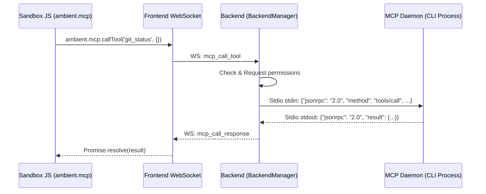

# MCP Integration

Model Context Protocol (MCP) connects the LLM with local command-line tools. The backend executes a stdio-based JSON-RPC client to delegate executions safely.

## 1. Running Architecture

The FastAPI backend manages external CLI processes through `StdioJsonRpcClient`:



## 2. API Usage

Inside the widget's `<js-script>` scope:

```javascript
ambient.mcp
  .callTool("git_status", { repo_path: "/workspace" })
  .then((result) => {
    console.log("Git details:", result);
  });
```
