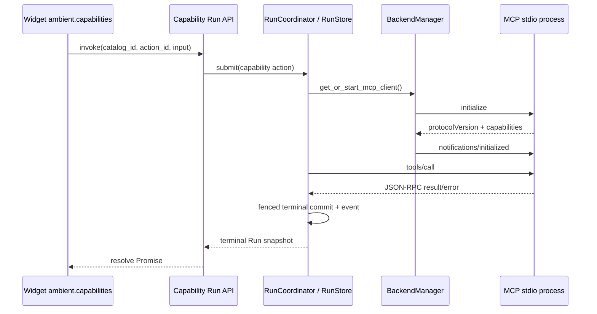

# MCP Integration

Ambient Agent manages MCP stdio subprocesses through `BackendManager`, with `StdioJsonRpcClient` implementing a bounded JSON-RPC 2.0 lifecycle. MCP tool actions normally execute as durable Runs rather than being owned by a browser connection.

## 1. Invocation path



An `mcp_tool` action declared by a Capability Manifest runs through `RunCoordinator`, with input and result schemas validated around execution. The Manifest action pins a specific `tool_name`, while the Widget's `capability.invoke` grant pins `catalog_id + action_id`. A new-version Widget cannot submit a raw MCP tool or resource name; MCP is an internal Capability adapter.

## 2. Client lifecycle

`StdioJsonRpcClient.start()`:

1. Starts the manifest argv with `asyncio.create_subprocess_exec()` and never invokes a shell.
2. Inherits a small allowlist needed for executables, locale, and temporary directories, then merges the manifest's explicit environment.
3. Starts a dedicated stdout reader and a bounded stderr-tail reader.
4. Sends MCP `initialize` within its deadline, validates protocol version and capability objects, stores negotiated capabilities, then sends `notifications/initialized`.
5. Reports `is_healthy` only after the handshake completes and while the transport has no failure.

Each `call()`:

- allocates a unique request ID and requires a valid JSON-RPC 2.0 object;
- checks that `tools/*`, `resources/*`, `prompts/*`, or `completion/*` methods have the matching advertised server capability; resource subscription also requires `subscribe: true`;
- requires a response to contain exactly one of `result` or `error`;
- applies a configurable deadline and maximum response-line size;
- removes the pending Future and best-effort sends `notifications/cancelled` after timeout or caller cancellation;
- fails the transport and every pending request on malformed JSON, oversized output, or stdout EOF.

A server-initiated `ping` receives a normal JSON-RPC response. Other unsupported client methods receive `-32601` instead of hanging silently. Notifications and late responses whose caller already timed out or cancelled are safely ignored.

`stop()` sends terminate, escalates to kill after a bounded grace period, and then closes stdin, reader tasks, and pending requests. Backend shutdown and `/api/runtimes/{id}/stop` use this path.

## 3. Permission identity

MCP spawn permission compares more than an executable command. A new identity includes:

```json
{
  "command": ["python", "-m", "mcp_weather"],
  "args": ["--stdio"],
  "env_digest": "sha256-of-explicit-manifest-env",
  "manifest_revision": "2:1.4.0"
}
```

A changed manifest revision or explicit environment creates a new identity and requires approval again. Approved identities are stored in `workspace/backend_permissions.json`.

A Capability Run persists an unapproved spawn as a Run interaction. Resolution atomically records the response with `run_version` and requeues the Run. Permission does not depend on a global Future, so the interaction remains resumable after backend restart.

## 4. Cancellation, recovery, and effects

- Cancelling a running MCP Run cancels the scheduler task, after which the client sends advisory cancellation to the MCP server.
- If a request reached the external process and its result cannot be confirmed, a manual-recovery Run enters `needs_attention` rather than claiming a safe cancellation or failure. A manifest `restart_safe` string cannot override this rule; only allowlisted read-only requests or a future adapter with enforceable idempotency/reconciliation may replay automatically.
- A healthy client can be reused by app ID. A changed manifest identity stops the old client and starts a new one.
- Run lease epochs fence local checkpoint commits; they cannot make an external MCP tool exactly-once. Actions requiring exactly-once behavior still need tool-level idempotency keys.

## 5. Current limitations

- The client rejects method families missing from negotiated capabilities, but it does not yet call `tools/list` to derive a dynamic per-tool allowlist.
- Capability actions pin the tool name in a Manifest; Widgets have no direct MCP entry point.
- MCP subprocesses have argv/environment/I/O/lifecycle controls but no OS-level filesystem/network sandbox.
- Client capabilities remain empty, so sampling/roots and similar server requests are unsupported; `ping` is handled and every other method receives explicit `-32601`.
