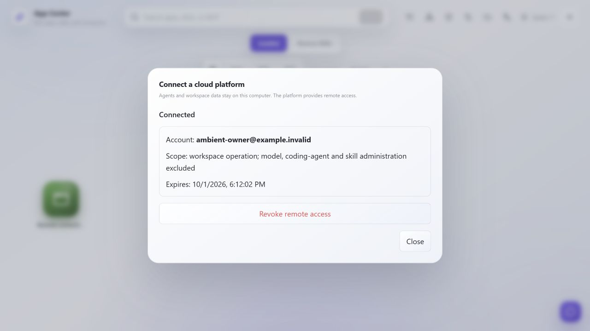
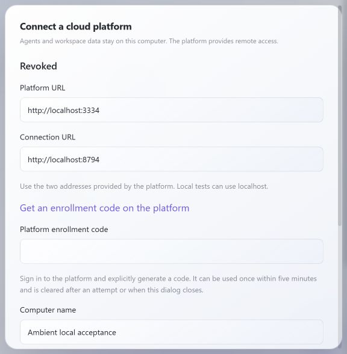
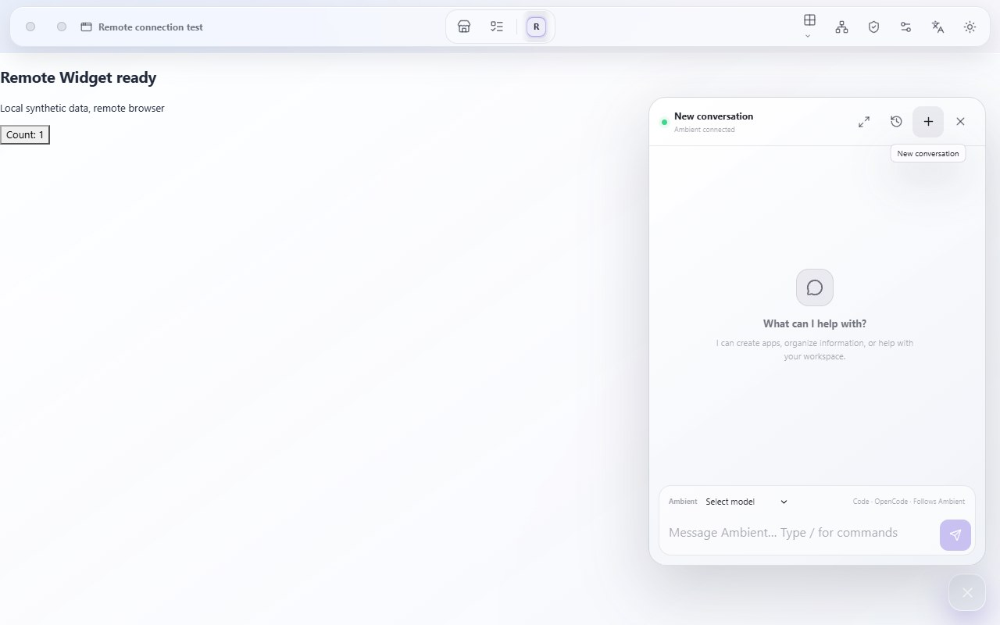

# Cloud handoff review and Ambient enrollment adaptation

## Decision and pinned versions

The cloud handoff matches the intent: agents, apps, files, provider credentials, and Runs remain owned and executed locally. The cloud provides accounts, authorization metadata, and a bounded relay. Five-minute account-bound enrollment limits anonymous admission without replacing claim or explicit local approval, and requires no Ambient submodule. Failures, disconnects, or lost replies never become repeated execution requests.

This review pins [Deploy d6dd823](https://github.com/BillShiyaoZhang/agent-collaboration-deploy/tree/d6dd823f1b379440616a2dc2e866ce9d9bac7729) and [Web fa55096](https://github.com/BillShiyaoZhang/agent-collaboration-web/tree/fa55096cc66f88f17f1b6191a5bc41d046cd08e8), checking source against the [handoff](https://github.com/BillShiyaoZhang/agent-collaboration-deploy/blob/d6dd823f1b379440616a2dc2e866ce9d9bac7729/docs/developers/AMBIENT_WORKSPACE_HANDOFF_2026-10-01.md). Independent Gateway regression passes 48/48; related Web account, enrollment, Origin, revocation, and deletion tests pass 78/78. Migration retains paired identities, invalidates pending/claimed nodes, and preserves permanent account tombstones. Cloud source, branches, and original checkouts remain unchanged.

## Client acceptance contract

Update the [architecture](../architecture/remote-workspace.md) and [usage](../guide/remote-workspace.md) before failing tests and implementation. Pairing requires a transient enrollment code, absent from disk, status, browser storage, URLs, logs, and exceptions. Validation 422 responses never echo input. Map 409/422/429/410 to bounded safe messages, preserving valid Retry-After for 429. Clear UI codes after every attempt or dialog close, prevent immediate resubmission while waiting, and keep local revocation immediate.

Successful unapproved polling remains at two seconds. Consecutive failures use exponential backoff with jitter and Retry-After. Invalid devices, expiry, revocation, or account deletion terminate authority, HTTP/WS forwarding, and cloud polling. Retain existing paired identities and data. A pending account ID is not a claim or approval.

The reusable `scripts/verify_remote_workspace_handoff.py --gateway-root <workspace-gateway-directory>` uses temporary SQLite, synthetic accounts, and real loopback Gateway networking with fixture local upstreams for Ambient Connector. It verifies enrollment, non-consuming wrong-account claims, claim/local approval, a real Tunnel, single writes, bidirectional WS/subprotocols, revocation/expiry/deletion, migration, and resource budgets. It does not replace real Ambient UI, model, or public-network acceptance.

## Actual local acceptance

UI and network acceptance use synthetic accounts and temporary SQLite workspaces without real models or original user data. Only processes started for this run are cleaned up. Ambient, Gateway, and Portal run on this Windows computer; nothing is deployed publicly.

| Check | Actual result |
| --- | --- |
| Backend focused Red/Green | Missing contract behavior first fails; final 68 pass, including stale replies and Tunnel capacity recovery |
| Full backend regression | 854 pass, 21 existing skips; one existing Starlette/httpx warning |
| Frontend focused Red/Green | Old implementation has 14 failures and 7 passes; final 21 pass |
| Full frontend regression | `npm --prefix frontend test -- --maxWorkers=2`: 37 files and 288 tests pass. The initial high-concurrency timeouts and subsequent empty-DOM failures do not pass; concurrency is limited without changing timeouts or assertions |
| Build and static checks | Frontend build/lint, Python Ruff, UML contracts, and 32 paired Chinese/English documentation pages pass |
| Cross-repository networking | `uv run python scripts/verify_remote_workspace_handoff.py --gateway-root <workspace-gateway-directory>`: six phases PASS; temporary services and databases are cleaned up |
| Real local and Portal UI | Explicit enrollment, pairing, same-account claim, continued requirement for local confirmation, scopes and one-hour expiry review, then approval and online status; administration remains unchecked |
| Backend restart | Node, grant, and origin are preserved; the new backend recovers paired/online status. The local Widget obtains a new ticket and Count changes 0→1 |
| Real local revocation UI | Local status becomes revoked with an empty enrollment input; Portal removes the current connection and shows revoked history with opening disabled; Gateway Tunnel count returns to zero |
| Real node-page UI | With explicit user authorization, headless Playwright uses an isolated temporary profile: seven checks and five stages PASS. On the same remote node, Widget Count changes 0→1 and chat shows connected; the synthetic conversation remains empty, without sending a message or calling an LLM |
| Browser authorization and Frame isolation | Single-use launch consumption removes the ticket from the URL. The node cookie is host-only, HttpOnly, and SameSite=Lax. The Frame comes from the same node's `/_ambient/frame.html`, retaining `allow-scripts` without `allow-same-origin`; the remote management status request returns 403 |
| Real remote WS and revocation | Three chat WS channels and one Widget operator WS are open simultaneously; Gateway reports one Tunnel and four browser WS channels. Local revocation closes all existing channels, old-cookie HTTP and page reload both return 401, and Tunnel/WS counts reach zero |
| Cleanup for this run | Browser/context close normally and the test Node process exits 0. At 2026-10-01 09:54:43 UTC, all 12 owned processes have exited, ports 3334/8794/8000/8001/5174 have no listeners, and both runtime records report stopped |

The real browser's [bounded acceptance result](../../verification/remote-workspace-handoff/remote-browser-acceptance.json) retains metadata including checks, stages, paths, counts, and pinned versions, with no ticket, cookie value, request headers, or body. The four paths are `/ws/chat`, `/ws/run-live`, `/ws/runs`, and `/ws/widgets/remote-fixture/client-runtime`. A pure React Widget maintains its own operator WS without requiring a Graph subscription. The browser makes no blocked external HTTP requests. The nonfunctional `/favicon.svg` resource returns 403; acceptance does not claim every resource returns 200.

Earlier, the in-app browser returned `ERR_BLOCKED_BY_CLIENT` for `<node>.localhost`, with no Chrome connection available. Portal launch auditing succeeded but node navigation was blocked. This is a historical diagnosis before Playwright authorization. An isolated fixture also returned 403 because its trusted Origin configuration was incomplete. After correcting only the fixture configuration and restarting it, fresh enrollment, pairing, and launch completed the acceptance above, without replaying writes or tickets or changing product code for that diagnosis.

The cross-repository tool covers a real Tunnel, bidirectional text/binary WS and subprotocols, a single write and no timeout replay, in-flight revocation, expired/replayed enrollment, non-consuming wrong-account claims and quota rejection, 429 cooldown, expiry/deletion/invalid-device termination, and legacy paired identity/origin restoration after both restarts. Phase six sets real Gateway Tunnel capacity to one, preserves the second node's credentials, and restores the same identity after the first node releases its Tunnel.

## Cloud capacity and release gates

The production overlay's default 128 MiB reservation budget is a real compatibility limit: current Resources accepts one Tunnel and two browser WS channels (109,331,432 bytes), then rejects the third WS with 429. Ambient chat needs command, run-live, and durable Run channels, and Widgets add connections. The default production configuration therefore cannot be claimed to pass full Ambient acceptance. The independent reservation probe accepts one Tunnel, four WS, and two HTTP requests at 256 MiB (209,746,904 bytes). The real UI run also explicitly uses 256 MiB (268,435,456 bytes), without changing the 128 MiB production default. Reservations are not measured process memory or safe production capacity.

Client contract adaptation and local acceptance are complete. Cloud merge/release must select budgets, container limits, and initial scale from full UI and actual RSS measurements. Real DNS, trusted wildcard TLS/renewal, registrable-domain isolation, production nginx/proxies, shared-host capacity, online backup restore, and rollback remain release gates. Local integration is not a production deployment.

Another reproduced compatibility issue is Gateway's pre-accept Tunnel capacity close code 1008, presented as HTTP 403 during the network handshake. Ambient now checks device state to distinguish temporary capacity from termination and preserve valid identities. Cloud should subsequently return an explicit 429/Retry-After handshake denial; this task does not change Cloud source.

The new Windows Gateway run joins memory and secret-free metrics by exact UTC timestamp, sampling approximately once per second. Initial idle WorkingSet is 53,420,032 bytes. The stable chat-plus-Widget window has eight samples at 2026-10-01 09:52:22.872951–09:52:29.991531 UTC, each with one Tunnel, four browser WS channels, and one sampling control request. WorkingSet minimum/median/maximum is 58,245,120 / 58,667,008 / 58,900,480 bytes, and maximum PrivateMemory is 45,215,744 bytes. The complete four-WS window across readiness, interaction, and chat has 13 samples (09:52:17.796253–09:52:29.991531 UTC), with maximum WorkingSet 60,977,152 and PrivateMemory 46,710,784 bytes. Observed process lifetime PeakWorkingSet is 60,985,344; this counter is not reset for the phase.

Instantaneous HTTP counts in the stable window are zero or two, with minimum/maximum reservations of 184,351,704 / 209,779,672 bytes. A separate readiness snapshot has four HTTP requests and reserves 235,207,640 bytes, including the sampling control request's 32,768 bytes. Queued bytes, capacity rejections, and backpressure closes remain zero. All 128 synchronized post-revocation samples have zero Tunnel/WS/HTTP, with the remaining 32,768-byte reservation belonging to metrics sampling itself. Raw `gateway-memory.jsonl`, `gateway-metrics.jsonl`, and `gateway-four-ws-summary.json` remain in this run's isolated cache; `cleanup-result.json` records owner verification and actual shutdown.

Historical sampling with only account controls, Connector, and blocked node navigation had no browser WS: idle WorkingSet 53,104,640 bytes, sampled maximum 58,052,608, process PeakWorkingSet 58,056,704, and maximum PrivateMemory 43,995,136. It is excluded from the new four-WS window above. Both runs are local Windows loopback synthetic workloads with unfilled queues. WorkingSet/PrivateMemory are not Linux container RSS, and a short four-WS pass cannot replace multi-node, shared-host, or 384 MiB production-container capacity acceptance.
