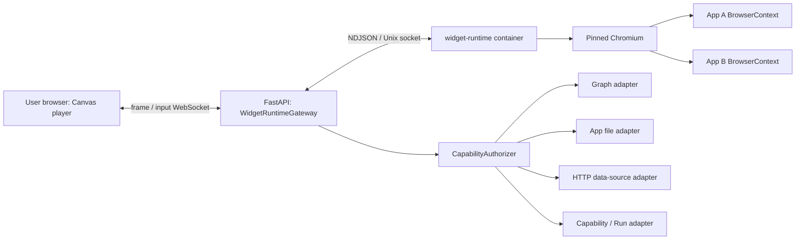

# Widget Isolation Runtime

A Widget Controller never executes in the user's browser or the Backend process. The default `balanced` mode runs one pinned `widget-runtime` container and one managed Chromium process. Each open App receives an independent BrowserContext, Page, CDP session, temporary storage area, and runtime budget. The user's browser only displays frames produced by the runtime and sends normalized input events back to it.

This separates browser compatibility from code isolation. Chrome, Safari, Edge, or Firefox on macOS, Windows, or Linux is only a frame player; a pinned Chromium inside Docker always executes the App's DOM, CSS, and JavaScript.

## 1. Deployment and trust boundary



`widget-runtime` must have:

- `network_mode: none`, so the runtime has no Docker network, Internet, Backend, or Graph route;
- one named volume shared with the Backend only for a Unix domain socket;
- no project, `workspace/`, Docker socket, provider credential, Graph credential, or host-directory mount;
- a read-only root filesystem and size-bounded tmpfs storage for temporary profiles/artifacts;
- a non-root user, `cap_drop: ALL`, `no-new-privileges`, and process/CPU/memory limits;
- Docker's outer seccomp profile is relaxed so Chromium can establish its own user-namespace and seccomp renderer sandbox on Docker Desktop/Linux; this is not `--no-sandbox`: Chromium's sandbox remains enabled while the container still has no network, no capabilities, a read-only root, and no host mounts;
- no remote-debugging TCP port. The supervisor controls Chromium only through a local pipe/CDP session.

The Backend can access the workspace and Graph, so it is not an untrusted-code execution environment. It must never evaluate Controller source, a browser process, or Controller-derived dynamic code.

## 2. Session and identity

The Frontend opens `/ws/widgets/{app_id}/runtime`. The Backend reads the current persistent Manifest, computes the artifact digest, and creates an unguessable runtime session. It stores:

```text
runtime_session_id -> {
  app_id,
  manifest_revision,
  grants_digest,
  artifact_digest,
  frontend_connection,
  runtime_connection
}
```

The Backend then sends `start` over the Unix socket with Controller source, digest, viewport, and a validated `presentation_context`. The Runtime cannot read an App by path; source enters only as a message and remains in memory/tmpfs.

A Controller RPC contains only a `request_id`, method, and parameters. Any `app_id`, revision, grants digest, or artifact digest in the payload is ignored. `WidgetRuntimeGateway` invokes `CapabilityAuthorizer` solely with its server-side session binding. A Manifest edit or revocation, artifact-digest change, Frontend disconnect, or Runtime restart closes the old session; a new connection reloads current authorization facts.

## 3. Frame and input protocol

The Runtime captures frames with `Page.startScreencast` and acknowledges processed frames using `Page.screencastFrameAck`. The Backend forwards each frame and its metadata to the current Widget:

```json
{
  "type": "frame",
  "session_id": "opaque",
  "frame_id": 42,
  "format": "jpeg",
  "data": "<base64>",
  "width": 640,
  "height": 480,
  "device_scale_factor": 1
}
```

The Frontend renders only the newest frame; a slow client cannot create an unbounded queue. Mouse, touch, wheel, key, text, focus, and viewport-resize events are normalized, sent to the Backend, and translated to CDP `Input.*` by the Runtime. Input messages cannot carry a capability identity. The initial Runtime WebSocket connection must carry the Widget's actual logical viewport and device-pixel ratio. A low-cost screencast event acts as the visual-change signal, while each delivered frame is captured at the corresponding physical-pixel resolution with `Page.captureScreenshot`. Screencasting restarts after viewport resize so a default low-resolution frame is never stretched. The Runtime WebSocket is recreated only when the App identity, revision, or grants digest changes; parent renders and callback-reference changes must not interrupt an opening or established connection. Infrastructure disconnects reconnect automatically with bounded exponential backoff and do not require a page refresh.

### Presentation context

Theme, language, and reduced-motion preference form a presentation-only context. They grant no data access and remain separate from Manifest grants, Graph scopes, and Runtime session identity:

```json
{
  "theme": {
    "preference": "system",
    "effective": "light"
  },
  "locale": "zh-CN",
  "reduced_motion": false
}
```

The Frontend supplies the initial context as WebSocket query parameters so Chromium uses the correct `colorScheme`, locale, and reduced-motion media emulation before the Controller's first render. The Backend normalizes the theme enums, BCP 47 locale, and boolean before creating the Runtime session; the Runtime never trusts raw Frontend payloads.

When the theme, language, or system reduced-motion preference changes, the Frontend sends a complete `presentation_context` input over the existing WebSocket session. Such changes must not recreate the BrowserContext or Runtime WebSocket. The Runtime updates `documentElement.lang`, `data-theme`, `color-scheme`, theme CSS variables, and media emulation, then notifies `ambient.presentation` and `ambient.theme` subscribers. The compatibility properties `ambient.theme.preference` and `ambient.theme.effective` read the current values rather than an initial frozen snapshot. For dynamic locale changes, Controllers use `ambient.presentation` and `documentElement.lang`; `navigator.language` is guaranteed to match only the initial locale of the BrowserContext.

Default budgets:

- only visible Widgets stay active; a minimized/hidden Widget pauses screencast and its Context may be destroyed after an idle timeout;
- each session keeps at most one pending outbound frame, and superseded frames may be dropped;
- frame rate and JPEG quality adapt between interactive and idle states;
- Context count, viewport, message size, concurrent RPC, CPU, memory, and session duration have hard limits;
- Chromium exit, Context crash, protocol failure, or budget exhaustion emits a structured `runtime_error` and clears subscriptions and pending RPC for that session.
- `start`, input, RPC responses, subscription events, `close`, and disconnect cleanup on one Runtime socket must execute serially. Disconnect cleanup may close a Context only after an in-progress `start` completes or is cancelled; it must not race Playwright Page/CDP creation.

The MVP uses CDP screencast to establish isolation and consistent cross-browser behavior. WebRTC encoding and data channels may replace this transport later for video efficiency or IME fidelity without changing the capability boundary.

## 4. SDK and capability RPC

The Runtime creates the smallest `ambient` facade in the Page. Graph, Network, Files, and installed-capability calls all travel through the Runtime Supervisor to the Backend:

```text
Controller -> ambient.graph.subscribe(...)
           -> isolated Page binding
           -> runtime rpc_request
           -> WidgetRuntimeGateway(session binding)
           -> CapabilityAuthorizer
           -> adapter
           -> rpc_response / subscription_event
```

The Runtime neither reads the Manifest nor decides grants. The Backend reauthorizes every operation against the current persistent Manifest:

- `graph.subscribe` / `graph.mutate` enter canonical-ontology and operation-scope checks;
- `net.request` enters HTTPS source allowlist, DNS/IP/redirect/size/content-type controls;
- `files.*` enters `app://data/` path scopes and atomic-write boundaries;
- `capabilities.invoke` enters catalog/action/input/output and Run-interaction policy.

The Backend owns subscriptions. Closing a session unregisters all Graph listeners. The Runtime only holds a session-local subscription ID and cannot reuse it for another App.

Idempotency identity for Graph mutations and installed-capability invocations is derived from the Runtime Supervisor's `request_id` plus the Backend-owned session binding. The Controller/Page does not generate or submit invocation identity and cannot depend on secure-context-only APIs such as `crypto.randomUUID()`.

## 5. Controller compatibility and publication verification

The existing Manifest V2 plus `controller.js` artifact remains unchanged, so generated Apps do not need edits. The Runtime supplies a renderer compatible with current `ambient.html`, `ambient.react` hooks, and standard components inside the isolated Page. Babel transpilation and the module wrapper move out of the user's browser and into the Runtime.

The publication verifier remains the first line of defense and rejects imports, dynamic imports, host globals, direct network/storage, dynamic capability IDs, and calls outside the Runtime Contract. The runtime container and per-operation Backend authorization are independent second and third lines; no layer is relaxed because another exists.

The staging smoke test for Widget generation/modification must use the same production Runtime Gateway and prove at least:

1. the Controller loads in isolated Chromium and produces a first frame;
2. requested Graph queries/mutations work with the approved schemas and grants;
3. an unapproved capability, forged App ID, and stale revision are rejected by the Backend;
4. direct Internet and host/workspace file reads fail;
5. runtime errors are classified as code, authorization/design, or infrastructure findings before automatic repair or human/operator intervention is selected.

## 6. Isolation levels and limits

Default `balanced` mode reuses one container and Chromium browser process across independent BrowserContexts. This significantly reduces per-App startup and memory cost, but a Chromium/browser-process or container-kernel escape remains part of the shared TCB; a BrowserContext is not a virtual-machine security boundary.

A future `strict` mode can start one runtime container and Chromium per App while reusing the same Gateway protocol. It improves cross-App failure and process isolation at higher memory/startup cost. Personal-laptop deployments do not use a microVM by default: Docker Desktop already runs inside a Linux VM on macOS/Windows, while Linux may optionally add rootless Docker or gVisor as a stronger host boundary. These deployment enhancements never replace no-network execution, no host mounts, Backend-bound identity, or capability authorization.

See [Widget Capability Security](/en/architecture/capability-security.md) for capability categories/scopes and [Widget Generation Information Contract](/en/architecture/widget-generation.md) for generation and repair inputs.
