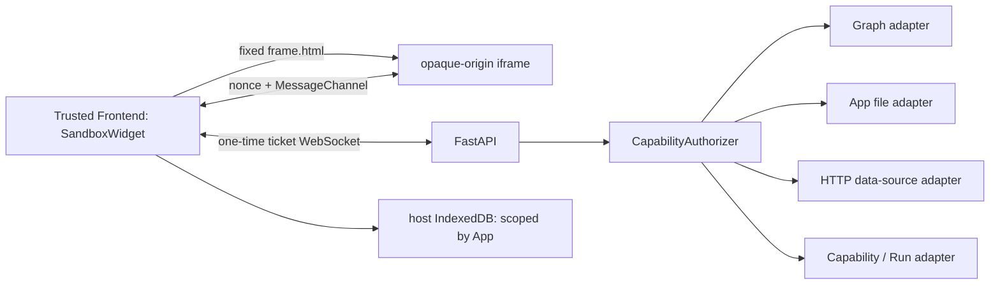

# Widget Isolation Runtime

By default, a Widget renders as a microfrontend inside an isolated iframe in the user's browser. The system no longer continuously streams JPEG/PNG frames from server-side Chromium. A Controller still uses Manifest V2 plus `controller.js`, but it is evaluated only inside a `sandbox="allow-scripts"` opaque-origin frame; neither the trusted React host nor the Backend evaluates Controller source.

The previous server-side Chromium pixel stream remains available for one release as an explicit rollback path; see section 7.

## 1. Deployment and trust boundary



Docker Compose adds a `widget-frame` service. Its browser-reachable port 8001 serves only the fixed Shell, renderer, and compiler assets. It receives no App ID, ticket, Controller, or user data and sets no Cookie. The Backend continues to issue tickets and process capability RPC on port 8000.

Local Compose always publishes port 8001. An HTTPS reverse proxy or path-prefixed deployment sets both the browser build variable `VITE_API_BASE_URL` and the Backend's `WIDGET_FRAME_URL` to public browser-reachable URLs; a Docker service name must never be returned to the browser.

The iframe combines:

- the HTML attribute `sandbox="allow-scripts"` without `allow-same-origin`, forms, popups, downloads, top navigation, or other permissions;
- `allow=""` and `referrerPolicy="no-referrer"`;
- a response CSP with `sandbox allow-scripts`, `default-src 'none'`, and `connect-src 'none'`, plus blocks for workers, child frames, objects, media, fonts, manifests, forms, and base URLs;
- a Permissions Policy denying camera, microphone, geolocation, clipboard, USB, serial, payment, credentials, and other browser capabilities;
- `Cache-Control: no-store` and `X-Content-Type-Options: nosniff`.

The CSP permits fixed same-service scripts and Babel's required `'unsafe-eval'`. Because CSP sandbox gives the document an opaque origin, fixed ES modules carry credentialless `Access-Control-Allow-Origin: *`. Those responses contain no App data, while Controller `fetch` and WebSocket calls remain blocked by `connect-src 'none'`.

## 2. Tickets, sessions, and identity

When opening a Widget, the trusted host:

1. calls `POST /api/apps/{app_id}/client-runtime-ticket`;
2. has its request `Origin` checked against `AMBIENT_FRONTEND_ORIGINS`;
3. receives a 256-bit, single-use ticket valid for 30 seconds plus a fixed `frame_url`;
4. connects to `/ws/widgets/{app_id}/client-runtime` with WebSocket subprotocols `ambient-widget-client-v1` and `ticket.<token>`;
5. has the Backend bind the consumed ticket to its issuance Origin, App ID, Manifest revision, grants digest, and Controller artifact digest.

The ticket never enters the iframe, URL, DOM, or local storage. Before the WebSocket opens, the Backend reloads the App snapshot. An expired/reused ticket, Origin or App mismatch, or changed artifact fails closed. Defaults allow at most 256 pending tickets and 16 active client-runtime sessions.

A Controller RPC contains only `{ request_id, method, params }`. The Frontend and Backend remove forged `app_id`, session, revision, grants, and artifact fields from the payload. Authorization and idempotency identity come only from the Backend-owned session binding. Every Graph, Network, Files, or installed-capability operation still enters the existing `CapabilityAuthorizer`.

## 3. Frame startup and communication

`frame.html` reads no query, Cookie, `localStorage`, or `IndexedDB`. The trusted host creates a `MessageChannel` and random nonce, then transfers one port to the iframe. The iframe accepts only the first direct-parent message with a matching protocol version and exactly one port, echoes the nonce, and immediately removes its global `window.message` listener.

All later communication uses the transferred port:

```text
Backend -> trusted host WS: bootstrap(controller_source, capability_ids)
Host -> frame port:          init(nonce, controller_source, capabilities, presentation)
Frame -> host port:          rpc_request / storage_request / host_event
Host -> frame port:          rpc_response / storage_response / subscription_event
```

The host never uses `eval`, `Function`, Babel, or React to render Controller code. Babel transformation, the module wrapper, and Preact rendering all occur in the isolated frame. Closing the port, WebSocket, or component rejects pending requests, closes the session, and unregisters Graph subscriptions. A server-side send lock serializes concurrent RPC and subscription output.

## 4. Local persistent data

A Controller uses `ambient.storage` for non-secret state belonging to the current browser and App:

```javascript
const draft = await ambient.storage.get("draft");
await ambient.storage.set("draft", { text: "local only" });
const keys = await ambient.storage.list();
await ambient.storage.delete("draft");
await ambient.storage.clear();
```

The trusted host writes the data to IndexedDB; iframe Cookies and storage are not used. The namespace always comes from the host-known `widget.id`, ignoring any identity fields in a Controller payload, so one Widget cannot select or read another Widget's namespace. Closing, reopening, or upgrading the same App ID reuses its data.

Constraints:

- keys contain 1–256 characters;
- values are bounded-depth, acyclic JSON values, at most 64 KiB each;
- each App is limited to 128 keys and 1 MiB total, preventing one Widget from exhausting the browser quota for the entire origin;
- a missing key returns `null`; mutations return `{ status: "ok" }`;
- data exists only in the current browser profile and may disappear when site data is cleared, private browsing ends, or the browser reclaims quota;
- never store credentials, API keys, access tokens, cross-device state, or the sole copy of user data.

## 5. Presentation context and host events

Theme, language, and reduced-motion preferences travel over the same port without rebuilding the iframe or WebSocket. The Runtime updates `documentElement` and CSS variables and notifies `ambient.presentation` and `ambient.theme` subscribers.

A Controller may request `fullscreen`, `minimize`, and `sendMessage`. The host processes only those three fixed events, with a 16 KiB message-text limit. The port cannot request arbitrary DOM operations, browser APIs, or host functions.

## 6. Security properties and limits

This design separates an untrusted Controller from the host page's DOM, Cookies, storage, JavaScript realm, and privileged browser APIs. It also avoids video encoding, frame latency, IME translation, blurry output, and loss of the accessibility tree. The Backend remains the final authorization boundary; client isolation never replaces per-operation capability checks.

It is not a VM-grade strong sandbox. Residual risks include:

- browser-engine vulnerabilities and side channels within the browser process;
- a malicious Controller consuming CPU or memory in the current tab;
- a sandboxed frame can navigate itself, so browser sandboxing and CSP greatly reduce direct networking but do not promise mathematically zero egress or covert channels;
- the verifier prevents mistakes and reduces attack surface; it is not a complete proof system for JavaScript.

Controllers and local storage therefore receive no secrets. Every Controller RPC, data value, and UI event is treated as untrusted input. High-risk capabilities remain protected by Backend policy, user confirmation, and audit.

## 7. Pixel-stream rollback

Build the Frontend with `VITE_WIDGET_UI_TRANSPORT=pixels` to restore the original `PixelSandboxWidget`, `/ws/widgets/{app_id}/runtime`, and zero-network Chromium `widget-runtime` container. Compose temporarily keeps both runtime services.

This is an emergency compatibility rollback, not the default. It retains video bandwidth, input forwarding, and higher resource usage, and it does not expose the new host IndexedDB `ambient.storage`. A new Widget that depends on local storage must not run in pixel mode. The old path can be removed after one release of deployment metrics and compatibility validation.

See [ambient SDK](/en/widgets/sdk.md) for APIs, [Widget Capability Security](/en/architecture/capability-security.md) for authorization, and [Widget Generation Information Contract](/en/architecture/widget-generation.md) for generation.
