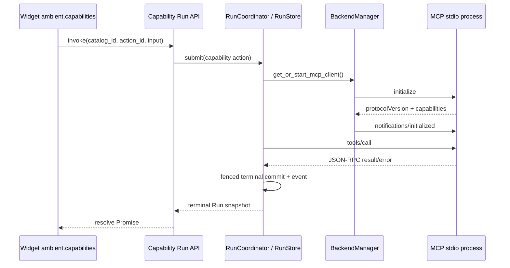

# MCP 工具集成

Ambient Agent 通过 `BackendManager` 托管 MCP stdio 子进程，并由 `StdioJsonRpcClient` 实现有界的 JSON-RPC 2.0 生命周期。MCP tool action 通常作为持久 Run 执行，而不是由浏览器连接直接拥有。

## 1. 调用路径



Capability Manifest 中的 `mcp_tool` action 由 `RunCoordinator` 执行，并在调用前后校验 input/result schema。Manifest action 固定具体 `tool_name`，Widget 的 `capability.invoke` grant 再固定 `catalog_id + action_id`。新版本 Widget 不能提交原始 MCP tool/resource name；MCP 只作为 Capability adapter 的内部实现。

## 2. Client 生命周期

`StdioJsonRpcClient.start()`：

1. 使用 `asyncio.create_subprocess_exec()` 和 manifest 的 argv 启动进程，不经过 shell。
2. 只继承运行可执行文件、locale 和临时目录所需的小型环境白名单，再合并 manifest 显式 env。
3. 启动独立 stdout reader 与有界 stderr-tail reader。
4. 在 initialize deadline 内发送 MCP `initialize`，验证 protocol version 与 capability object，保存 negotiated capabilities，再发送 `notifications/initialized`。
5. 只有完成 handshake 且 transport 未失败时，`is_healthy` 才为真。

每次 `call()`：

- 分配唯一 request ID，并要求合法 JSON-RPC 2.0 object；
- 调用 `tools/*`、`resources/*`、`prompts/*` 或 `completion/*` 前检查 server 是否声明对应 capability；resource subscribe 还要求 `subscribe: true`；
- response 必须恰好包含 `result` 或 `error`；
- 使用可配置 deadline 和最大单行 response 大小；
- timeout 或 caller cancellation 会清理 pending Future，并 best-effort 发送 `notifications/cancelled`；
- malformed JSON、超大响应或 stdout EOF 会使 transport 失败，并以同一异常结束所有 pending request。

Server 发起的 `ping` 会得到正常 JSON-RPC response；其他未声明的 client method 返回 `-32601`，不会被静默挂起。Notification 与已经 timeout/cancel 的迟到 response 可以安全忽略。

`stop()` 先 terminate，在 bounded grace period 后升级为 kill，随后关闭 stdin、reader task 和所有 pending request。Backend shutdown 与 `/api/runtimes/{id}/stop` 都使用该路径。

## 3. 权限身份

MCP spawn 权限不只比较可执行命令。新身份由以下字段共同确定：

```json
{
  "command": ["python", "-m", "mcp_weather"],
  "args": ["--stdio"],
  "env_digest": "sha256-of-explicit-manifest-env",
  "manifest_revision": "2:1.4.0"
}
```

manifest revision 或显式 env 改变会形成新的身份并重新求权。批准内容保存于 `workspace/backend_permissions.json`。

Capability Run 在执行前把未批准 spawn 保存成 Run interaction；resolve 以 `run_version` 原子记录响应并重新入队。权限不依赖全局 Future，后端重启后 interaction 仍可恢复。

## 4. 取消、恢复与副作用

- 取消 running MCP Run 会取消 scheduler task；client 随后向 MCP server 发送 advisory cancellation。
- 如果调用已经送到外部进程且结果无法确认，manual-recovery Run 进入 `needs_attention`，不会声称安全取消或安全失败。Manifest 的 `restart_safe` 字符串不会覆盖这一规则；只有白名单只读 request 或未来具备可强制幂等/对账协议的 adapter 才可自动重放。
- 健康的 client 可按 app_id 复用；manifest identity 变化时旧 client 会停止并重新启动。
- Run lease epoch 只保护本地 checkpoint/commit，不能让外部 MCP tool 自动 exactly-once。需要 exactly-once 的 action 仍必须由 tool 自身支持 idempotency key。

## 5. 当前限制

- client 已按 capability family 拒绝未声明的 method，但尚未调用 `tools/list` 建立动态 per-tool allowlist。
- Capability action 的 tool 名由 manifest 固定；Widget 没有直接 MCP 入口。
- MCP 进程有 argv/env/I/O/生命周期约束，但不是 OS 级 filesystem/network sandbox。
- client capability 当前为空，因此不支持 sampling/roots 等 server request；`ping` 已支持，其他 method 会收到显式 `-32601`。
