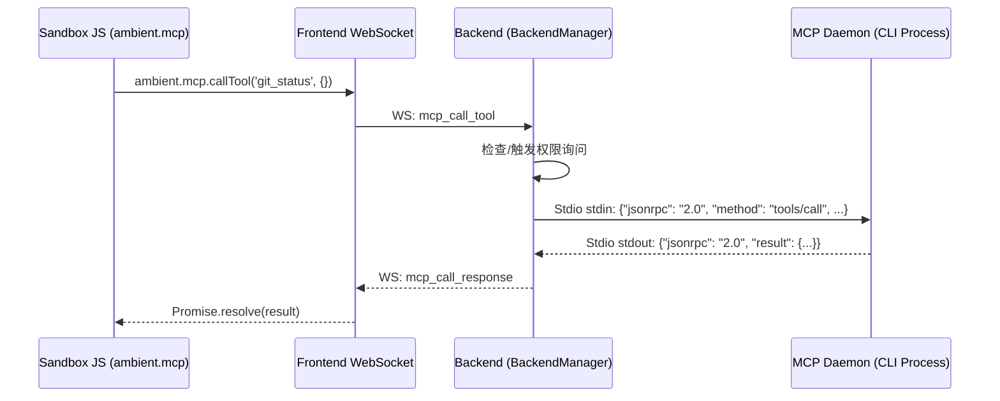

# MCP 工具集成 (Model Context Protocol)

Model Context Protocol (MCP) 是用于大模型连接外部数据源与本地命令行工具的开放协议。Ambient Agent 的后台集成了 MCP 客户端，允许特定的 Widget 卡片通过安全通信，调用宿主机上的各种命令和读取本地资源。

---

## 1. 运行机制与生命周期

在 `backend/backend_manager.py` 中，系统实现了一个基于 stdio 管道输入输出的异步 JSON-RPC 2.0 客户端 `StdioJsonRpcClient`：



### 启动与通道：
1.  **进程拉起**：当 Widget 声明需要使用 MCP 且用户授权同意后，`BackendManager` 会通过 Python `asyncio.create_subprocess_exec` 拉起外部 CLI 工具子进程。
2.  **Stdio 管道交互**：子进程与后台通过标准输入 `stdin` 和标准输出 `stdout` 交互，每行一条 JSON-RPC 协议消息。
3.  **WebSocket 桥接**：前台发来的请求被分配唯一的 `call_id`，并向后端发送。后端执行 MCP 并把异步结果通过 `mcp_call_response` 发回给前端特定的事件监听器。

---

## 2. API 调用方式

Widget 的 JavaScript 环境可以通过 `ambient` 提供的方法进行异步调用：

### 调用 MCP 工具 (Call Tool)
```javascript
// 示例：运行 git 状态查询工具
ambient.mcp.callTool("git_status", { repo_path: "/workspace" })
  .then((result) => {
    console.log("Git status outputs:", result);
  })
  .catch((err) => {
    console.error("Tool execution failed:", err);
  });
```

### 读取 MCP 资源 (Read Resource)
```javascript
// 示例：读取特定的环境日志资源
ambient.mcp.readResource("file:///logs/today.txt")
  .then((content) => {
    root.querySelector("#log-view").textContent = content;
  });
```

---

## 3. 安全规范

*   **进程隔离**：所有 MCP 进程都是随 Widget 的生命周期按需启动。当卡片被销毁或 Session 关闭时，后端会自动调用 `StdioJsonRpcClient.stop()`，通过 `terminate()` 干净地销毁子进程。
*   **权限白名单**：任何 Widget 想要启动或调用任何外部 CLI 进程，都必须在 `backend_permissions.json` 中配置显式白名单，否则会进入拦截阻断状态并向用户弹窗求权。
