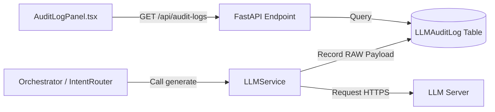

# 权限与审计

为了保障宿主机的文件系统、终端环境安全，以及让用户随时清晰知晓数据的去向，Ambient Agent 引入了一套**显式授权审批与多维度数据审计系统**。

## 1. 权限配置文件 `backend_permissions.json`

系统的权限记录以静态 JSON 的形式持久化保存在工作区根目录下的 `workspace/backend_permissions.json` 文件中。

### 结构示例

```json
{
  "weather-app": {
    "mcp_servers": [
      {
        "command": ["python", "-m", "mcp_weather"],
        "args": ["--port", "9000"]
      }
    ],
    "agents": ["http://localhost:5000/agent/v1"]
  }
}
```

### 属性说明

- **Key (如 `weather-app`)**: 对应 Widget 的 `app_id`。所有权限以应用卡片为单位进行网状授权和强隔离。
- `mcp_servers`: 允许拉起运行的 MCP 命令列表（command 和 args 的数组前缀必须精确匹配）。
- `agents`: 允许该 Widget 连接和委托的外部智能体 SSE/Webhook URL 白名单。

## 2. 运行时弹窗求权

当 Widget 触发了上述未被白名单授权的高危动作时，后端的 `BackendManager` 会实施拦截：

1.  **挂起等待**：后端生成包含 `request_id` 的 Promise 异步锁，并挂起该调用线程。
2.  **前端广播**：通过 WebSocket 发送 `type: "backend_permission_request"` 消息至前端。
3.  **UI 弹窗**：React 前端的 `AppPermissionModal` 组件被唤起，以醒目的警示框提示用户：_“卡片 [AppID] 正在请求执行命令行权限，是否允许？”_
4.  **保存并释放**：用户如果点击“拒绝”，后端抛出异常拒绝运行；如果点击“同意”，后端将配置追加到 `backend_permissions.json` 之中保存，并释放 Promise 锁恢复执行。

## 3. 大模型传输审计面板

大模型的数据泄漏与安全同样是一个焦点。为了让大模型每一次调用都绝对透明，系统实现了一个**明细审计链条**：

### 审计数据流向



### 核心审计内容：

- **原始 PromptPayload**：记录发送给 LLM 接口的完整系统指令（System Prompt）、聊天上下文历史和注入的 Widget 源码。您可以清晰查看有无敏感隐私数据泄漏。
- **LLM 返回流 (RAW Response)**：大模型吐出的原始文本或结构化意图，包括未被正则清洗掉的完整 XML 代码块。
- **审计界面**：用户随时可以在主页侧边栏点击 **Audit Log** 按钮唤起审计面板，它会按时间倒序展示出全部的审计单。
