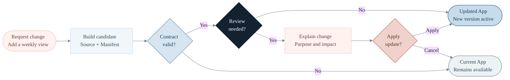
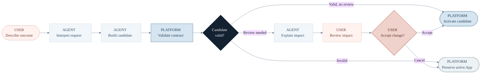
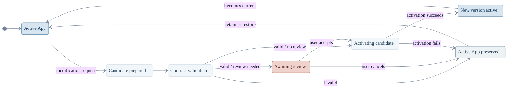

# Manifest UX Workflow

## Purpose

The Manifest remains a machine-readable contract, but users should not need to
read or edit raw JSON. Ambient Agent can translate validated declarations into
a concise explanation when an App is modified.

These diagrams clarify three different questions:

1. What does the user experience during a modification?
2. Which responsibilities belong to the user, Agent, and platform?
3. What future lifecycle boundary keeps the current App available on failure?

Only the contract, validation, one-time migration, and AppManager integration
belong to Phase 1. The review, activation, and recovery flows are product and
architecture boundaries for later work, not implementation commitments.

## 1. Future user-facing modification workflow

This future path, which is not implemented in Phase 1, separates machine
validation from user-facing review while avoiding unnecessary confirmation
for low-risk updates.

The Manifest can support the explanation by providing validated identity,
purpose, version, intent hints, and central schema references. It does not
prove that the code has no other behavioral or data-access changes, and schema
references do not grant permissions or authorize graph mutations.

`Review needed?` represents a future UX policy. Meaningful purpose or behavior
changes may warrant a preview, while a low-risk visual correction should not
necessarily interrupt the user.

## 2. Future responsibility boundary

This future platform-gate view keeps ownership visible without three heavy
containers. Phase 1 establishes only Manifest contract validation; activation
and preservation remain later platform responsibilities.

The responsibilities are:

- **User:** describe the desired outcome, understand meaningful impact, and
  accept or cancel when review is required.
- **Agent:** interpret the request, prepare a candidate, and write a readable
  explanation.
- **Platform (future lifecycle):** validate the contract, control activation,
  and preserve the current App when the candidate cannot proceed.

## 3. Future candidate lifecycle and recovery boundary

A state diagram expresses desired lifecycle boundaries more accurately than
another workflow. It separates stable states from validation, consent,
activation, and recovery transitions.

Candidate staging, atomic activation, previous-version recovery, and
activation-failure handling are beyond Phase 1. The diagram records a safety
boundary for later design, not a guarantee implemented by the Manifest PR: an
unsuccessful candidate should not destroy the currently usable App.
