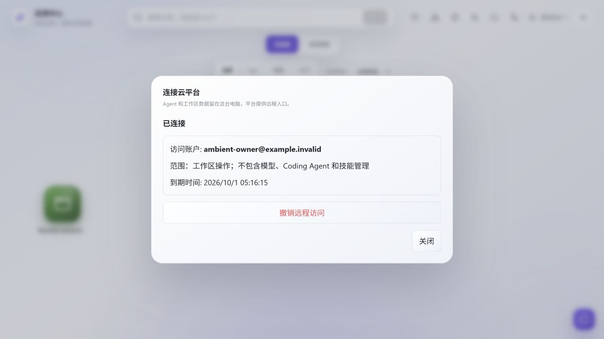
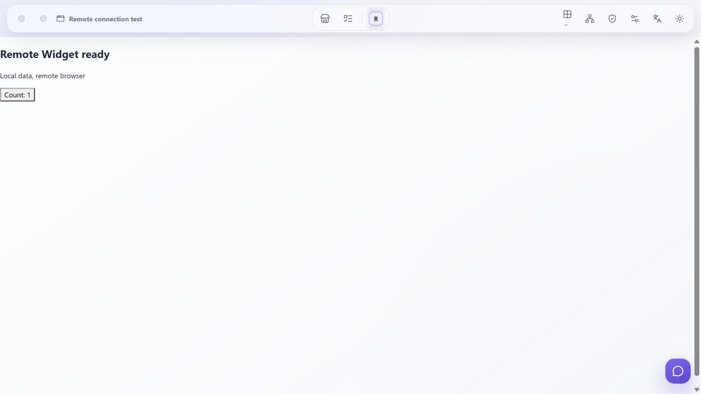
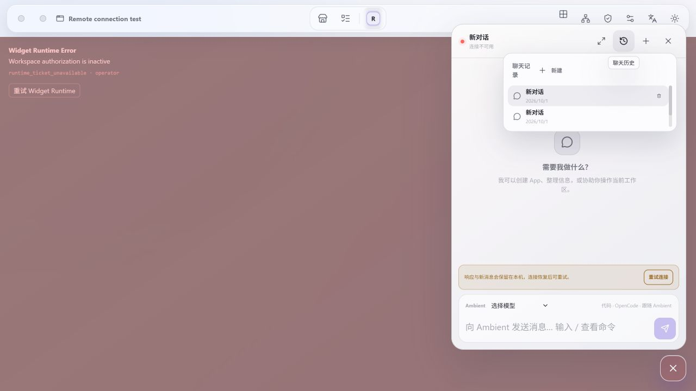

# 远程工作区本地验收

## 环境与隔离

2026-10-01，Windows、Python 3.13、Node 24、Codex 内置 Chromium 浏览器。测试使用 `.cache` 独立 Ambient 工作区、独立云端建议检出、Gateway SQLite 和门户数据库；两个合成账户，不调用真实模型、邮件或线上平台。Ambient 原有用户数据与原云项目检出未修改。测试前台使用 5174（5173 已占用），后端 8000、Frame 8001、Gateway 8788、Web 3310；仅测试进程选择前台端口覆盖，产品默认端口保持 5173。

## 交互证据

浏览器完成本机生成一小时授权链接、登录回跳保留连接码、云端领取、本机核对账户/范围/期限并确认；平台随后显示在线。生成配对链接前未连接；领取时不自动批准。截图展示已批准的合成账户和默认范围：

远程页面使用独立 `<node_id>.localhost:8788` 域名，前台 API/WS 使用该同源入口。真实 Frame shell 与全部固定模块加载，浏览器 Widget 握手成功，点击计数由 0 变为 1。聊天显示“Ambient 已连接”，通过远程 UI 新建对话后历史显示两个本地会话。

本机撤销后，已有 Widget 显示授权失效、聊天连接不可用；平台刷新显示已撤销并禁用打开按钮。对节点 Host 的原生 HTTP 请求返回 401。重启后端与 Gateway 时，原已确认授权恢复且无需重新领取；未发生写请求重放。

## 自动化验证

前端完整 36 个文件、275 个测试通过，生产构建和 lint 通过。后端完整 814 个测试通过、21 项跳过；Connector + Compose focused 35 项通过；Ruff check 与 144 个文件 format 检查通过。Gateway 22 项契约回归通过，Widget facade/frame/server 21 项通过。Web 完整 suite 在本机隔离 Linux 容器中 397/397 通过；相关定向单测 41 项通过，生产构建、Next lint 与等价 ESLint 通过。真实 HTTPS NextAuth、账户/Origin 隔离、已批准授权的错误密码保护、成功删除后 Gateway 撤销/旧 cookie 失效及迟到确认拒绝通过；结果保存在隔离 build 的日志。

建议包的两份增量 Git bundle 已在仅含原基线的隔离检出中完成校验与离线恢复。Deploy 建议 commit 为 `392deca500c7db906e7ba971ee04f258f1cc52e1`，Web 为 `fc271b6b4093fa23b334869d22c0edee11b27da4`；父项目 Web gitlink 与恢复后的 Web HEAD 一致，Platform/SDK 版本未变。云端源检出与恢复检出均无待提交变更；原云项目未修改，Ambient 不含 submodule。导出包、元数据、校验和与恢复记录位于仓库根 `proposals/agent-collaboration-deploy`。

## 运行限制

当前锁定 LiteLLM 1.92.0 无 Windows 预编译 wheel。本机回归使用 SHA 与 uv.lock 一致的官方源码生成仅用于测试的纯 Python wheel，官方可选 native bridge 保持 fallback；依赖版本和锁文件不变。记录保存在 `.cache/dependency-build`。生产镜像安装方式不变。

部署仓库历史文档检查存在 92 处旧报告引用缺失构建产物；新建议文档未产生链接错误。没有伪造旧测试产物或放宽断言。Windows 上的 Web 完整 suite 为 396 通过、1 个既有 POSIX 0600 权限用例失败；该测试与安全实现的 Git blob 均与基础版本一致，未放宽安全检查，同一完整 suite 在 Linux 容器全绿。Ambient Compose 和 Gateway overlay 只完成配置解析，未启动用户现有容器。浏览器走原生隔离服务；本地通过不代表公网 TLS、服务器入口或多副本已验证。
