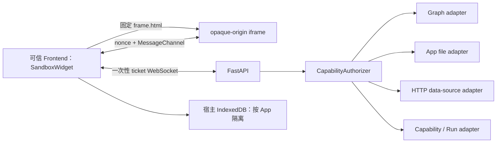

# Widget 隔离运行时

Widget 默认作为微前端在用户浏览器中的隔离 iframe 内渲染，不再把服务端 Chromium 的 JPEG/PNG 帧持续传给前端。Controller 仍使用 Manifest V2 + `controller.js`，但它只在 `sandbox="allow-scripts"` 的 opaque-origin frame 中求值；宿主 React 页面和 Backend 都不会执行 Controller 源码。

旧的服务端 Chromium 像素流保留一个发布周期作为显式回滚路径，见第 7 节。

## 1. 部署与信任边界



Docker Compose 新增 `widget-frame` 服务，在浏览器可访问的 8001 端口只提供固定 Shell、renderer 和编译器资源。它不接收 App ID、ticket、Controller 或用户数据，也不设置 Cookie。Backend 仍在 8000 端口签发 ticket 和处理 capability RPC。

本地 Compose 固定公开 8001。HTTPS 或带路径前缀的反向代理部署应同时设置浏览器构建变量 `VITE_API_BASE_URL` 和 Backend 的 `WIDGET_FRAME_URL`，两者都必须是浏览器可访问的公网 URL；不能把 Docker service name 发送给浏览器。

iframe 同时使用：

- HTML 属性 `sandbox="allow-scripts"`，不包含 `allow-same-origin`、表单、弹窗、下载、顶层导航或其他权限；
- `allow=""`、`referrerPolicy="no-referrer"`；
- 响应 CSP：`sandbox allow-scripts`、`default-src 'none'`、`connect-src 'none'`，并禁止 worker、子 frame、object、media、font、manifest、form 和 base URL；
- Permissions Policy 禁止相机、麦克风、定位、剪贴板、USB、串口、支付、凭据等浏览器能力；
- `Cache-Control: no-store`、`X-Content-Type-Options: nosniff`。

CSP 允许固定的同服务脚本和 Babel 所需的 `'unsafe-eval'`。由于 CSP sandbox 使文档成为 opaque origin，固定 ES modules 带无凭据 `Access-Control-Allow-Origin: *`；该响应不包含 App 数据，Controller 的 `fetch`/WebSocket 仍被 `connect-src 'none'` 阻断。

## 2. Ticket、会话与身份

打开 Widget 时，可信宿主执行：

1. `POST /api/apps/{app_id}/client-runtime-ticket`；
2. Backend 校验请求 `Origin` 是否在 `AMBIENT_FRONTEND_ORIGINS`；
3. Backend 返回 30 秒有效、256-bit、单次使用的 ticket，以及固定 `frame_url`；
4. 宿主连接 `/ws/widgets/{app_id}/client-runtime`，WebSocket 子协议为 `ambient-widget-client-v1` 与 `ticket.<token>`；
5. Backend 消费 ticket，并把会话绑定到签发时的 Origin、App ID、Manifest revision、grants digest 和 Controller artifact digest。

ticket 不进入 iframe、URL、DOM 或本地存储。WebSocket 建立前 Backend 会重新读取 App snapshot；ticket 过期、重复使用、Origin/App 不匹配或 artifact 已变化都会失败。默认最多保留 256 个待使用 ticket 和 16 个活动 client-runtime session。

Controller RPC 只允许 `{ request_id, method, params }`。Frontend 与 Backend 都会移除 payload 中伪造的 `app_id`、session、revision、grants 和 artifact 字段；授权和幂等身份只使用 Backend 保存的 session binding。每次 Graph、Network、Files 或 installed-capability 操作仍进入既有 `CapabilityAuthorizer`。

## 3. Frame 启动与通信协议

`frame.html` 加载后不读取 query、Cookie、`localStorage` 或 `IndexedDB`。可信宿主创建 `MessageChannel` 和随机 nonce，把一个 port 发送给 iframe。iframe 只接受来自直接 parent、协议版本匹配且携带一个 port 的首次消息，回显 nonce 后立即移除全局 `window.message` listener。

后续通信只走转移后的 port：

```text
Backend -> trusted host WS: bootstrap(controller_source, capability_ids)
Host -> frame port:          init(nonce, controller_source, capabilities, presentation)
Frame -> host port:          rpc_request / storage_request / host_event
Host -> frame port:          rpc_response / storage_response / subscription_event
```

宿主不会用 `eval`、`Function`、Babel 或 React 渲染 Controller。Babel 转译、module wrapper 和 Preact 渲染全部发生在隔离 frame。端口、WebSocket 或组件卸载时会关闭 session、拒绝 pending request 并注销 Graph subscriptions；服务端并发发送由单一锁串行化。

## 4. 本地持久数据

Controller 使用 `ambient.storage` 保存当前浏览器、当前 App 的非秘密状态：

```javascript
const draft = await ambient.storage.get("draft");
await ambient.storage.set("draft", { text: "local only" });
const keys = await ambient.storage.list();
await ambient.storage.delete("draft");
await ambient.storage.clear();
```

数据实际由可信宿主写入 IndexedDB，而不是写入 iframe Cookie 或 storage。namespace 永远取自宿主已知的 `widget.id`，忽略 Controller payload 中的身份字段，因此一个 Widget 不能选择或访问另一个 Widget 的 namespace。同一个 App ID 关闭、重开或升级后复用数据。

约束如下：

- key 为 1–256 个字符；
- value 必须是有限深度、无循环的 JSON 值，单值最大 64 KiB；
- 每个 App 最多 128 个 key、合计最多 1 MiB，避免一个 Widget 耗尽整个 origin 的浏览器配额；
- 缺失 key 返回 `null`，修改操作返回 `{ status: "ok" }`；
- 数据只存在当前浏览器 profile，清理站点数据、隐私模式结束或浏览器配额回收都可能删除它；
- 不用于凭据、API key、access token、跨设备同步或用户数据的唯一副本。

## 5. 展示上下文与宿主事件

主题、语言和减少动画偏好通过同一个 port 发送，不需要重建 iframe 或 WebSocket。Runtime 更新 `documentElement`、CSS variables，并通知 `ambient.presentation` / `ambient.theme` subscribers。

Controller 可请求 `fullscreen`、`minimize` 和 `sendMessage`。宿主只处理这三个固定事件，消息文本上限为 16 KiB。它不能通过 port 请求任意 DOM 操作、浏览器 API 或宿主函数。

## 6. 安全性质与限制

这一方案把不可信 Controller 与宿主页面的 DOM、Cookie、storage、JS realm 和浏览器高权限 API 分开，也避免视频编码、帧延迟、输入法映射、清晰度与无障碍树丢失。Backend 仍是最终授权边界：客户端隔离不能替代逐次 capability 校验。

它不是 VM 级强沙箱。需要明确保留的风险包括：

- 浏览器引擎漏洞，以及同一浏览器进程中的侧信道；
- 恶意 Controller 消耗当前 tab 的 CPU/内存；
- sandboxed frame 可以导航自身，因此浏览器沙箱与 CSP 只把直接网络能力降到很低，不承诺数学意义上的零外联或零隐蔽信道；
- verifier 是防误用和缩小攻击面，不是 JavaScript 的完整证明系统。

因此 Controller 和本地 storage 都不能接触秘密；来自 Controller 的所有 RPC、数据和 UI 事件都按不可信输入处理。高风险 capability 必须继续由 Backend policy、用户确认和审计保护。

## 7. 像素流回滚

构建 Frontend 时设置 `VITE_WIDGET_UI_TRANSPORT=pixels` 可恢复原 `PixelSandboxWidget`、`/ws/widgets/{app_id}/runtime` 和零网络 `widget-runtime` Chromium 容器。Compose 暂时同时保留两个 runtime 服务。

该模式用于紧急兼容回滚，不是默认路径。它继续承担视频带宽、输入转发和较高资源占用，并且不提供新的宿主 IndexedDB `ambient.storage`；依赖本地存储的新 Widget 不应在 pixel 模式运行。一个发布周期后，在部署指标与兼容性验证完成时可删除旧链路。

完整 API 见 [ambient SDK](/widgets/sdk.md)，授权语义见 [Widget 能力安全架构](/architecture/capability-security.md)，生成流程见 [Widget 生成信息契约](/architecture/widget-generation.md)。
