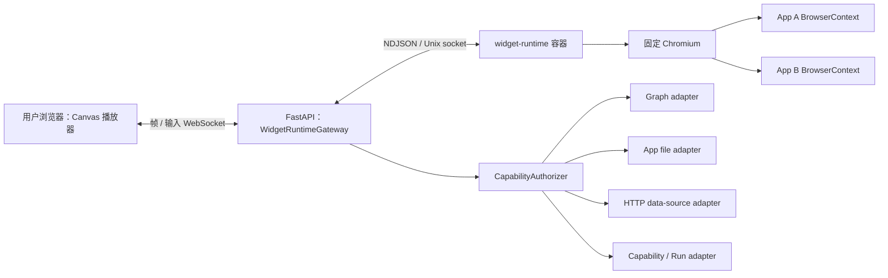

# Widget 隔离运行时

Widget Controller 不在用户浏览器或 Backend 进程中执行。默认 `balanced` 模式使用一个固定镜像的 `widget-runtime` 容器和一个受管理的 Chromium 进程；每个打开的 App 获得独立的 BrowserContext、Page、CDP session、临时存储与运行预算。用户浏览器只显示运行时产生的画面，并把经过归一化的输入事件送回运行时。

该设计把浏览器兼容性与代码隔离分开：macOS、Windows、Linux 上的 Chrome、Safari、Edge 或 Firefox 都只是画面播放器，App 的实际 DOM、CSS 和 JavaScript 始终由 Docker 内固定版本的 Chromium 执行。

## 1. 部署与信任边界



`widget-runtime` 必须满足：

- `network_mode: none`，运行时没有 Docker 网络、公网、Backend 或 Graph 直连；
- 只与 Backend 共享一个仅用于 Unix domain socket 的命名卷；
- 不挂载项目、`workspace/`、Docker socket、Provider 凭据、Graph 凭据或宿主目录；
- root filesystem 只读，临时 profile/artifact 写入有大小上限的 tmpfs；
- 非 root 用户运行，`cap_drop: ALL`、`no-new-privileges`、进程/CPU/内存上限；
- 为让 Chromium 在 Docker Desktop/Linux 中建立自己的 user-namespace + seccomp renderer sandbox，容器放开 Docker 外层 seccomp profile；这不是 `--no-sandbox`：Chromium 沙盒保持开启，容器仍无网络、无 capability、只读且无宿主挂载；
- 不开放 remote-debugging TCP 端口。Supervisor 只通过本地 pipe/CDP session 控制 Chromium。

Backend 仍可访问工作区和 Graph，因此它不是不可信代码执行环境。任何 Controller 源码、浏览器进程或 Controller 派生数据都不能在 Backend 中求值。

## 2. 会话与身份

打开 Widget 时，Frontend 连接 `/ws/widgets/{app_id}/runtime`。Backend 读取当前持久 Manifest，计算 artifact digest，并创建不可猜测的 runtime session。Backend 保存：

```text
runtime_session_id -> {
  app_id,
  manifest_revision,
  grants_digest,
  artifact_digest,
  frontend_connection,
  runtime_connection
}
```

随后 Backend 通过 Unix socket 发送 `start`，包含 Controller 源码、digest、viewport 和主题。Runtime 不能通过文件路径读取 App；源码只以消息传入并保存在 tmpfs/内存中。

Controller 发出的 RPC 只包含 `request_id`、方法和参数。`app_id`、revision、grants digest 或 artifact digest 即使出现在 payload 中也必须忽略；`WidgetRuntimeGateway` 只使用 server-side session binding 调用 `CapabilityAuthorizer`。Manifest 修改、撤权、artifact digest 改变、Frontend 断线或 Runtime 重启都会关闭旧 session，下一次连接重新加载授权事实。

## 3. 画面与输入协议

Runtime 使用 `Page.startScreencast` 获取画面，并在每帧处理后发送 `Page.screencastFrameAck`。Backend 将帧和元数据转发给当前 Widget：

```json
{
  "type": "frame",
  "session_id": "opaque",
  "frame_id": 42,
  "format": "jpeg",
  "data": "<base64>",
  "width": 640,
  "height": 480,
  "device_scale_factor": 1
}
```

Frontend 只渲染最新帧；慢客户端不能形成无界队列。鼠标、触摸、滚轮、按键、文本输入、焦点与 viewport resize 被归一化后发送到 Backend，再由 Runtime 转换为 CDP `Input.*`。输入消息不允许携带 capability 身份。Runtime WebSocket 只在 App 身份、revision 或 grants digest 改变时重建；父组件 render 或事件回调引用变化不能中断正在建立或已建立的连接。基础设施断连使用有上限的指数退避自动重连，不要求用户刷新页面。

默认预算：

- 仅可见 Widget 保持活跃；最小化/不可见 Widget 停止 screencast，并可在空闲后销毁 Context；
- 每个 session 只保留一个待发送帧，较旧帧可丢弃；
- 帧率和 JPEG 质量按交互/静止状态自适应；
- Context 数、viewport、消息大小、RPC 并发、CPU、内存和会话时长都有硬上限；
- Chromium 退出、Context 崩溃、协议错误或预算超限产生结构化 `runtime_error`，并清理该 session 的订阅和 pending RPC。
- 同一 Runtime socket 上的 `start`、输入、RPC response、subscription event、`close` 和断连清理必须串行执行。断连清理只能在正在执行的 `start` 完成或取消后关闭 Context，不能与 Playwright 创建 Page/CDP session 并发。

MVP 使用 CDP screencast，先保证隔离和跨浏览器一致性。若后续对视频效率或输入法支持要求更高，可以在不改变 capability 边界的前提下替换为 WebRTC 编码和数据通道。

## 4. SDK 与 capability RPC

Runtime 在 Page 创建最小 `ambient` facade。Graph、Network、Files 和 installed capability 的调用都通过 Runtime Supervisor 转发到 Backend：

```text
Controller -> ambient.graph.subscribe(...)
           -> isolated Page binding
           -> runtime rpc_request
           -> WidgetRuntimeGateway(session binding)
           -> CapabilityAuthorizer
           -> adapter
           -> rpc_response / subscription_event
```

Runtime 不能自行读取 Manifest 或判断 grant。Backend 每次操作都以当前持久 Manifest 为准重新授权：

- `graph.subscribe` / `graph.mutate` 进入规范本体和 operation scope 检查；
- `net.request` 进入 HTTPS source allowlist、DNS/IP/redirect/size/content-type 限制；
- `files.*` 进入 `app://data/` path scope 与原子写边界；
- `capabilities.invoke` 进入 catalog/action/input/output 与 Run interaction policy。

订阅由 Backend 所有。session 关闭时 Gateway 注销全部 Graph listeners；Runtime 只持有 session-local subscription ID，不能把它复用于其他 App。

## 5. Controller 兼容与发布验证

现有 Manifest V2 + `controller.js` 产物格式保持不变，不要求修改已生成 App。Runtime 在隔离 Page 内提供与现有 `ambient.html`、`ambient.react` hooks 和标准组件兼容的 renderer。Babel 转译和 module wrapper 从用户浏览器移入 Runtime。

发布 verifier 仍是第一道防线，拒绝 import、dynamic import、host global、直接网络/storage、动态 capability ID 与超出 Runtime Contract 的调用。运行时容器和后端逐次授权是独立的第二、第三道防线；任何一层都不能因为另外一层存在而放宽。

生成/修改 Widget 的 staging smoke test 必须经过与生产相同的 Runtime Gateway，至少证明：

1. Controller 能在隔离 Chromium 中加载并产生首帧；
2. 申请的 Graph query/mutation 在批准 schema 与 grant 下成功；
3. 未批准的 capability、伪造 App ID 和过期 revision 被 Backend 拒绝；
4. 直接公网访问与宿主/工作区文件读取失败；
5. runtime error 被分类为代码、授权/设计或基础设施问题，再决定自动修复还是请求用户/运维介入。

## 6. 隔离等级与限制

默认 `balanced` 模式在一个容器和 Chromium browser process 内复用多个独立 BrowserContext。它显著降低每 App 启动和内存成本，但 Chromium/browser-process 或容器内核逃逸仍属于共享 TCB；BrowserContext 不是虚拟机安全边界。

未来可选 `strict` 模式为每个 App 启动独立 runtime 容器和 Chromium，并复用同一 Gateway 协议。它改善 App 间故障与进程隔离，但消耗更多内存和启动时间。个人笔记本默认不启用 microVM：Docker Desktop 在 macOS/Windows 已位于 Linux VM 内；Linux 可选 rootless Docker 或 gVisor 作为额外宿主边界。这些部署增强不能替代无网络、无宿主挂载、后端身份绑定和 capability 授权。

完整类目与 scope 见 [Widget 能力安全架构](/architecture/capability-security.md)，生成与修复信息见 [Widget 生成信息契约](/architecture/widget-generation.md)。
