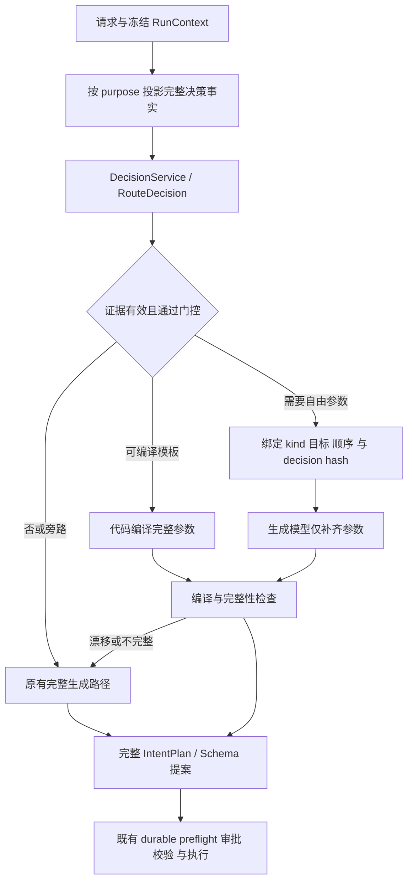

# 决策与生成分离的 Agent Harness

实现后的实际验证、成本与已知限制见 [RESULTS.md](RESULTS.md)。

本设计把有限选项判断与执行参数生成分开：Jev 为声明的候选和规则提供结构化证据，生成模型补齐自由文本与完整参数，编译器检查两者的绑定，再交给既有 durable workflow。目标是减少重复决策和无必要的生成调用，同时保留用户审批、权限、Schema、顺序与恢复边界。默认配置为 `off`；实现契约与故障轨迹测试不等于任意真实任务都有高准确率或高 QoS。

早期 [Jev 路由研究](../jev-intent-router/README.md) 记录分类能力与项目生成职责的差别；[首轮接入说明](../jev-intent-router/IMPLEMENTATION.md) 记录仅允许高置信对话直达的兼容路径。本设计扩大的是有完整编译与校验约束的决策使用范围。

## 决策生成与执行边界



决策不是授权，也不直接改变 durable phase 的执行权限。合法标签无法替代 Graph query/actions、App 目标、有序子步骤或 Schema 提案。未知、歧义、上下文超限、候选不完整、模型错误和编译漂移都使用原有完整生成路径，不拼装缺字段对象继续执行。

| 组件 | 输入与产物 | 边界 |
| --- | --- | --- |
| `DecisionService.evaluate` | purpose、state、questions、`DecisionConfig` → `DecisionBundle` | 提供封闭选项证据与 provenance，不执行工具 |
| `RouteDecision` | 八类 kind 与完整 App 候选 | 保留完整概率和实际版本，不生成自由参数 |
| `IntentGenerationTask` | 固定 kind、指令、目标 App、decision hash | 生成 schema 移除可重选字段；compile 拒绝改选与旧 hash |
| `validate_complete_plan` | 完整 `IntentPlan` | 检查必要字段；Graph、Schema、权限与 effect 仍由 durable 验证 |
| `SchemaSelection` | 完整 Schema inventory 与批准计划 | 确定复用候选集合；生成提案不能扩展选中的复用集合 |
| `DurableAgentWorkflow` | 通过编译的计划和批准 contract | 保持整体 preflight、interaction、staging、verification、effect ledger 和 fencing |

## 通用 DecisionService 契约

每个 purpose 明确提供不可信 state 与可信问题规则。支持三类独立问题：`choice` 返回合法候选、完整概率分布与供应商 confidence；`noul` 返回 yes 概率；`score` 返回声明等级上的分布、期望分数与 legend。问题共享 state、独立求值，调用者不能把后一问当作读过前一问答案的连续推理。Score 是证据，不能仅凭分数提升权限或通过硬校验。

候选在输入中使用 opaque key，再由代码映射精确业务 ID，避免与 `none` 等哨兵冲突。完整候选集合必须在限制内；过限回退，不能截掉正确候选后把剩余集合称为完整。Choice 门控同时要求最高概率达到 `min_probability` 和第一、第二名差值达到 `min_margin`。Noul 对所要求的 yes 或 no 分别检查概率与二元差值。它们都不是已校准的项目正确率。

Score 校验保留严格的数值类型、有限值、范围、概率总和、完整等级 keys 与精确 legend 检查。分数通常须与加权期望一致；若 score 和各概率都落在两位小数网格，额外检查舍入是否能解释差异：各概率在裁剪到 `[0,1]` 的 `p ± 0.005` 区间内，且真实概率总和为 1，求可行加权期望的最小值与最大值；只有该区间与 `score ± 0.005` 相交才接受。接受后保留供应商 score，不改写成显示概率的加权平均。这是根据实测响应推断的有限兼容规则，不是供应商对精度的承诺；Choice/Noul 的概率与 margin 门槛不变。

`DecisionBundle` 记录实际固定模型、完整安全答案、`state_hash`、`request_hash`、usage、耗时与固定错误码。请求 hash 绑定 purpose、配置、问题和 state；各业务 projection 另外记录上下文版本、输入或候选 hash 与候选覆盖。审计 stage 为 `decision:<purpose>`，同时保留 Run/session/step/attempt/trace 与相关 artifact hash。生成任务绑定 `decision_hash` 和指令 `input_hash`，编译时核对对应决策，防止使用旧判断补齐新请求。

路由分类保留 `route_decision`，参数生成使用 `intent_generate`，旧完整生成与细化保留 `route` / `route_refine`。`schema_selection_compile` 记录选择集合、生成集合、丢失 ID 和编译/回退状态，本身不重复计费；真正模型调用的 usage 归属决策或生成 stage。开发计划复核以 candidate 输入 hash 绑定并保存到 Run evidence，仍进入原计划 approval。

状态和返回值做 JSON、类型、大小与字段校验，认证 header、运行时 key 和敏感字段不写入快照或审计。返回只保留合法答案、模型和数字 usage；HTTP 200 中答案非法时仍保留可验证的安全 usage。timeout、HTTP 错误或非法返回使用固定错误码，不保存可能包含凭据的异常文本。已知固定版本的 `cost_usd` 依据官方输入 token 单价估算；网络超时的未知费用不能当零或实际账单。

决策、参数生成及后续细化都消耗 Run 的模型调用、token、费用和剩余 wall-clock 预算。连续阶段传递剩余时间；取消与 `BudgetExhaustedError` 向上传播，不能伪装成成功或越过预算继续回退。

## 按用途保留完整信息

路由 projection `routing-context-v2` 只发送一次当前请求、路由相关 App 候选、已选历史/摘要和 Graph 类型计数，不重复完整 App manifest 或全 capability catalog。它保留输入中已有的完整请求、候选与历史内容，不按词数再截断后采用决策。历史窗口仍由 `RouterContext` 的上游选择形成；超限回退完整生成路径。metadata 记录上下文/候选 hash、字符数、历史数和完整候选覆盖。

缺 `context_version` 的旧路由快照按 `routing-context-v1` 解释，使用原有 prompt 渲染；新环境配置默认 v2。恢复读取快照版本，不用新 projection 重解释同一 Run。通用业务投影各有 purpose 与 source hash，不能直接复用路由上下文作所有阶段的判断。

## 各阶段的采用规则

| 阶段 | 允许采用的决策 | 生成与硬校验 |
| --- | --- | --- |
| 路由 | 高置信 kind 和一致的已有 App 目标 | `IntentGenerationTask` 固定决定；只补自由参数，编译后进入原工作流 |
| Graph 查询 | 已知 Schema 的有限只读列表模板 | 模板可直接编译；复杂 filters、聚合或自由结构继续生成，拒绝空 query |
| Graph 变更 | 判断请求属于数据变更 | 自由文本变更仍生成完整 actions，随后 preflight 与用户审批 |
| 复合请求 | 对完整有序候选计划做语义复核 | 只有参数完整且复核接受才省 refiner；次序、kind 与目标锁定，仍先整体 preflight |
| Schema 对齐 | 全 inventory 的逐候选 Noul 与 disposition Choice | 生成提案受复用集合约束；歧义、候选缺失或集合不一致回退完整生成，source hash 追溯该次冻结输入 |
| 计划复核 | 有限规则的语义证据 | 保留用户计划审批与所有确定性校验，不自动批准或提升 capability |
| Schema 验证 | 生成 fallback 返回结构化 findings | 三组 finding 列表完整有效后一次构造 `VerificationDiff`；任一问题阻止 promotion |

Schema 选择同时独立判断 Graph context 是否需要、各已有实体是否复用，以及无需 Graph、复用已有、需要新结构、候选缺失或歧义的 disposition。不是对一个摘要做 top-k 检索；完整 inventory 和完整批准计划是集合约束的依据。新结构仍由生成模型提案并经过用户批准，候选选择不会创建类型或授予权限。

Schema verification 的模型 fallback 不是信任模型给出的 `is_clean`。只有明确返回三组合法空列表才为 clean；未知属性、类型不匹配或未知类型中的任何一项都产生 warning 并进入 `wait_override`。审批也不能跳过 mandatory findings，只能选择返工代码、Schema 或计划。

## 冻结配置与兼容恢复

`RunContext.workflow_decisions` 来自 `model_snapshot.workflow_decisions`，与 `jev_router` 一起在新 Run 提交时保存全部非秘密配置。旧快照缺 `workflow_decisions` 时固定为 `off`，不读取当前环境意外启用新路径。API key 仍仅在请求时读取 `TYPESAFE_API_KEY`。

| 环境变量 | 默认值 |
| --- | --- |
| `JEV_DECISION_MODE` | `off` |
| `JEV_DECISION_STAGE_MODES` | `{}`，未指定用途继承 `JEV_DECISION_MODE` |
| `JEV_DECISION_MODEL` | `jev-1.13.0` |
| `JEV_DECISION_TIMEOUT_SECONDS` | `1.5` |
| `JEV_DECISION_MIN_PROBABILITY` | `0.95` |
| `JEV_DECISION_MIN_MARGIN` | `0.15` |
| `JEV_DECISION_MAX_STATE_CHARS` | `12000` |
| `JEV_DECISION_MAX_CANDIDATES` | `48` |
| `JEV_DECISION_MAX_QUESTIONS` | `64` |

固定规则版本为 `ambient-decision-v1`。模型只接受固定 `jev-x.y.z`，响应版本须匹配。`off` 使用原有路径；`shadow` 收集证据而不采用新判断；`cascade` 只在用途门控、绑定与编译通过后采用。

`DecisionConfig.stage_modes` 是冻结配置中的用途模式字典，以 JSON 环境变量 `JEV_DECISION_STAGE_MODES` 设置。只接受 `intent_parameters`、`graph_query_template`、`schema_selection`、`composite_review`、`development_plan_review` 五个用途，以及 `off`、`shadow`、`cascade` 三种值；非法 JSON、用途或模式会拒绝新 Run 快照。每个用途优先使用字典中的模式，缺项继承全局 `mode`；默认 `{}`，旧配置缺字典时也按 `{}` 解释。Run 保存并恢复整个非秘密字典，环境变更不改变已有 Run。模式配置与 API key 无关，key 仍不进入配置或快照。

路由扩大采用范围需要 `jev_router.mode=cascade`，且 `intent_parameters` 的有效用途模式为 `cascade`；Graph 模板、复合复核和其他阶段分别检查自己的有效模式。旧配置仅开启 `JEV_ROUTER_MODE=cascade` 时保持原来的高置信 `converse` 直达语义，Graph/App/复合请求继续旧完整 Router。显式 slash 命令和外部 Skill 的既有沙箱在模型决策前生效，不受新模式改变。

可以只启用路由决策绑定后的参数生成，其他用途先保持旁路：

```dotenv
JEV_ROUTER_MODE=cascade
JEV_DECISION_MODE=off
JEV_DECISION_STAGE_MODES='{"intent_parameters":"cascade","graph_query_template":"shadow","schema_selection":"shadow","composite_review":"shadow","development_plan_review":"shadow"}'
```

`shadow` 仍会调用付费 API 并增加延迟；不需要收集证据的用途可设为 `off`。实测合成用例中的多项 Noul 未达到既定门槛，触发安全回退，因此按用途启用允许先评估路由参数生成，避免同时采用其他阶段。该配置不意味着语义质量已提高，也不降低 Choice/Noul 门槛。

## 验证 QoS 与逐步启用

测试先证明故障轨迹：候选/上下文过限回退；合法 HTTP 200 但答案非法的 usage 保留；kind/目标/hash 或 Schema 集合漂移被拒绝；生成参数缺失不执行；复合顺序和整体 preflight 不被省略；verification findings 阻止发布；取消、超时、预算与恢复不重复 effect。这些检查覆盖实际代码的控制和失败路径，不声称所有真实语义任务都有 QoS 保证。

模型语义效果需单独测量：人工复核的真实留出集、中文/英文与跨轮上下文、数据/代码变更边界、复合漏动作、候选召回、accepted accuracy 与 coverage，以及相同完成节点的 p50/p95、总调用费用、回退与最终成功率。mock 或合成用例不能代替真实数据，也不能把旧生成模型结果自动作为金标。

先使用 `shadow` 核对契约和分歧，再按用途逐步启用 `cascade`。每次模型、规则或 projection 版本升级重新验收。实际评估结果、费用估算与 CI 验证应在完成后附上对应实验范围和来源；缺少测量的指标保持未知。
