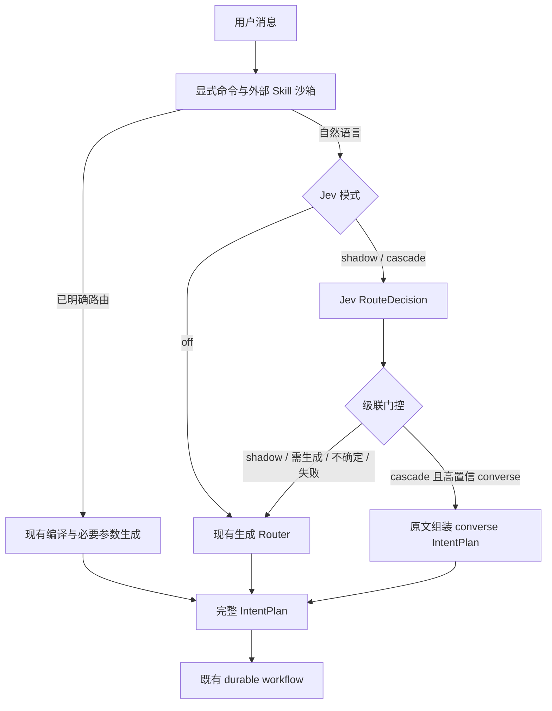

# Jev 意图分类层实现

本文记录研究之后的接入边界。原 [README.md](README.md) 保留 2026 年 10 月 2 日研究时的代码依据与结论；其中的未实现问题属于当时基线，不代表当前实现状态。接入默认关闭，尚不能据实现或 mock 测试宣称项目中文准确率、真实费用或延迟改善。

以下模式说明保留首轮兼容路径；同时启用通用决策级联后的参数生成、Schema 选择与复核架构见[决策与生成分离设计](../decision-generation-harness/DESIGN.md)。

## 分类对象与执行对象

Jev 使用 TypeSafe 的独立 `systemone` API，不加入 chat-completions 模型列表。一次请求对同一 state 询问八类顶层 kind 和已有 App 候选；App 选择还包含 `none` 和 `multiple`。问题独立求值，代码负责解释它们的一致性。

独立 `RouteDecision` 保留 kind、完整八类概率分布、供应商 confidence、实际模型版本，以及候选 App 的选择与概率证据。它没有 Graph query/actions、生成的 App ID 或有序 sub-intents。完整工作流仍以 `IntentPlan` 为接口，现有生成 Router 继续承担参数生成与计划细化。



`cascade` 仅允许通过概率与一致性检查的 `converse` 省略生成 Router。Graph 查询、Graph 变更、App 创建/修改、复合请求和澄清全部调用旧 Router 生成完整计划。Jev 标签不会构造缺参数的执行对象，尤其不会将 `graph_query` 标签包装成 `query={}`。原始指令用于直达对话；现有只读 tool loop、审批、Graph preflight、App staging 与验证继续由 durable workflow 执行。

显式 `/ask`、`/app`、`/create`、`/skill` 在 Jev 前按现有规则编译。`/query`、`/mutate` 的 kind 已确定，剩余参数仍由受约束生成 Router 产生。外部 Skill 继续先进入只读语义沙箱，不调用 Jev。

## 概率门控与回退

门控使用 Jev 的完整原始概率分布：最高 kind 概率须达到 `min_probability`，最高与第二名的差值须达到 `min_margin`。响应的标签、完整分布、数值范围、模型与 App 选择也须有效。直达 `converse` 的 App 选择必须为 `none` 或无候选问题；存在候选 App 分布时，`none` 也须达到同样的概率和差值门槛。供应商 confidence 保留作证据，不当作校准后的项目正确率。

该门控只决定是否采用 Jev 的简单直达分支。它不对旧 `IntentPlan.confidence` 实施阈值，旧字段仍是生成模型自评分。低置信意味着回退完整生成 Router；缺少用户信息则由完整 Router 决定是否澄清。

缺 key、请求超时、HTTP 错误、无效响应、state 超上限或门控不通过时均回退现有 Router。错误记录原因，不伪造概率。state 包含最新用户请求、上下文摘要、候选 App 和语言，并把这些内容视为不可信数据；state 超过上限或 App 候选超过 253 个时拒绝本次 Jev 调用，不截断内容或候选后继续直达。

## 配置、Run 恢复与审计

| 环境变量 | 默认值 |
| --- | --- |
| `TYPESAFE_API_KEY` | 未设置 |
| `JEV_ROUTER_MODE` | `off` |
| `JEV_ROUTER_MODEL` | `jev-1.13.0` |
| `JEV_ROUTER_TIMEOUT_SECONDS` | `1.5` |
| `JEV_ROUTER_MIN_PROBABILITY` | `0.95` |
| `JEV_ROUTER_MIN_MARGIN` | `0.15` |
| `JEV_ROUTER_MAX_STATE_CHARS` | `48000` |

`mode` 可为 `off`、`shadow` 或 `cascade`。`off` 不需要 key，也不发送 Jev 请求。将 key 安全注入后端运行环境；仓库、Run 快照和日志均不保存它。

新 Run 将完整非秘密配置与固定分类规则版本保存到 `model_snapshot.jev_router`，通过 `RunContext.jev_router` 传递。模型只接受固定 `jev-x.y.z` 版本，拒绝 `jev-latest`、`jev-preview`；响应中的实际模型版本必须与 Run 配置精确一致。非法环境配置会在创建 Run 时返回配置错误。恢复使用冻结配置，不重读新环境的模式和阈值；历史 Run 缺少该字段时固定按 `off` 恢复。key 仅在请求时从运行环境读取，因此轮换 key 不需要将它写入持久状态。

`LLMAuditLog` 的 `route_decision` stage 保存独立分类证据、请求的配置版本、实际模型版本、usage 和延迟。`response.routing` 保存 `mode`、`reason`、完整 `decision`、`top_probability`、`margin`、非秘密 `config`、`selected_plan_kind` 与 `kind_agreement`。常规原因是 `shadow_mode`、`intent_uncertain`、`requires_generated_plan`、`direct_converse`、`target_conflict` 或 `target_uncertain`；传输和校验失败使用固定错误码，避免异常文本泄露凭据。HTTP 200 返回的 decision 无效时，`JevRouterError` 仍携带可验证且经白名单清洗的 usage/model，供错误审计与评估脚本记录。现有 `route`、`route_refine` stage 也保存响应 usage。Jev `cost_usd` 按已知固定版本的官方输入 token 单价估算，不是实际账单；网络超时等情况的未知 usage 不按零费用统计。认证 header 和 key 不进入审计记录。

## 验证与逐步启用

固定版本的首次真实接口与合成分类结果见 [LIVE_EVALUATION.md](LIVE_EVALUATION.md)，包含可回放的分类证据。结果不作为生产准确率或完整工作流成功率。

先注入测试环境的 key，设置 `JEV_ROUTER_MODE=shadow`，验证实际接口和审计记录，并保持旧 Router 的最终计划。旁路按顺序先调用 Jev，再调用旧 Router，增加一次受超时限制的往返，并非后台异步请求。比较同一冻结上下文的分类分歧，人工复核错误；旧 Router 的结果不自动作为金标。

Jev 与后续生成共用路由墙钟预算，生成阶段只接收扣除已耗时后的剩余时间。两次调用和用量均受现有预算限制；预算耗尽与取消向上层传播，不降级成普通服务故障。旁路会增加调用和 token 消耗，因此也可能提前耗尽同一预算。

现有 [cases.json](cases.json) 是 55 条人工合成种子，其中显式命令与待产品策略裁决项单列。评分器只读取本地预测，不发送请求或执行副作用。它能检查 kind、目标 App、子意图顺序和只读误入副作用分类；完整 Graph 参数与最终任务成功仍需额外评估。

可从仓库根目录运行以下命令，对全部 48 条合成自然语言种子调用实际 Jev API。它会产生 API 费用，排除显式命令，仅将分类结果写入指定文件，不执行 Graph、App 或工具副作用。key 从进程环境或本地 `.env` 读取，命令参数中不包含 key；输出文件放在仓库外，必须是未存在的新文件：

```bash
.venv/bin/python -B -m scripts.evaluate_jev_router \
  --limit 48 \
  --output /private/tmp/ambient-jev-live.jsonl
```

脚本沿用冻结配置字段与默认 `1.5` 秒请求超时，可用 `--timeout-seconds` 覆盖该次实验的超时。它直接调用分类 API，与完整 Router 的 `off`/`shadow`/`cascade` 分支不同；不会调用旧生成模型作基线，也不会补齐 Graph 参数或复合计划。输出中的 `abstain` 只按 kind 的最高概率与差值计算，用于分类选择性分析，不代表实际 cascade 的直达接受状态或覆盖率；实际门控还要求 `converse` 和 App 选择一致性。8 条待产品策略裁决标签仍须单列。HTTP 200 中的 decision 校验失败仍记录可验证的 usage；网络超时等调用可能已产生费用却无法得到 usage，汇总只能报告已知用量，不能将这些调用视作零费用。

运行评分器自检和预测回放：

```bash
.venv/bin/python -B proposals/jev-intent-router/evaluate.py --self-test
.venv/bin/python -B proposals/jev-intent-router/evaluate.py \
  --predictions /private/tmp/ambient-jev-live.jsonl \
  --output /private/tmp/ambient-jev-evaluation.json
```

每行预测包含与 case 对应的 `id`、`kind`，可带完整 `probabilities`、`app_id`、`abstain` 和实测遥测。Jev 分类只能评估 kind 与 App；没有生成的子步骤不冒充完整级联结果。`abstain` 表示拒绝采用分类，分母同时保留覆盖率。费用、token 或延迟缺失时保留 unknown/null。

启用 `cascade` 前，用人工复核的独立留出集检查中文、跨轮指代、数据与代码操作边界、复合漏动作及对抗上下文。至少同时报告 accepted accuracy、coverage、样本数、回退率，以及相同完成点的 p50/p95 与完整调用费用。mock 契约测试和一次实际 API 冒烟只验证接线，不证明这些质量或收益指标。扩大直达范围或升级模型版本需要重新验收；默认模式保持 `off`。
