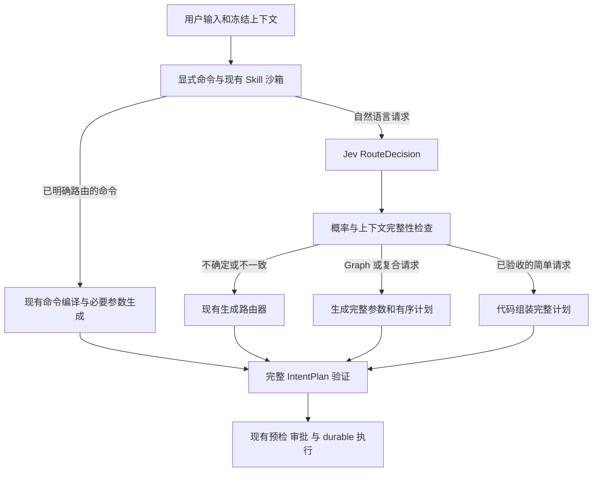

# Jev 在 Ambient Agent 中的意图路由适配研究

研究日期为 2026 年 10 月 2 日，代码基线为 `2f9741a87240b2844f1d1d16b88b89a92e7b006f`。研究对象是 TypeSafe AI 的 Jev 决策模型，重点是本项目的工作流意图路由，而非为用户自动挑选生成模型。

**结论：Jev 适合作为第一层意图分类和候选 App 选择的试验对象，当前不适合直接替换整个 `IntentRouter`，也没有足够的本项目实测证据支持默认上线。** 推荐先旁路评估，再考虑让少量高置信简单请求省掉现有路由 LLM。Graph 参数生成、多意图拆解和计划细化继续由生成模型承担。

本研究完成了代码审计、官方 API 与限制核对、独立论文复核，以及离线评估准备。没有调用 Jev，也没有测得它在本项目的准确率、延迟或实际费用。文中的上线门槛和收益情景属于建议或假设。

## 项目的路由任务

当前首层路由使用会话 fast model，未配置时回退 primary；复合意图的第二层细化使用 primary。首层通过 `classify_intent` 工具调用返回 `IntentPlan`，随后 durable workflow 按 kind 分发。可选 kind 有 `converse`、`graph_query`、`graph_mutation`、`widget_create`、`widget_modify`、`multi_intent`、`plan_and_act`、`clarify`。

函数名容易让人把它理解成分类器，实际输出还包括执行所需的内容：Graph 查询和动作、App ID、改写后的 instruction、有序子意图和澄清选项。只换一个更便宜的分类模型，并不能完成这份接口契约。

| 职责 | 现有需求 | 对 Jev 的适配判断 |
| --- | --- | --- |
| 顶层 kind | 八类选一，结合当前工作区和会话 | 适合试验，须测数据操作与代码修改的混淆 |
| 已有 App 选择 | 根据 ID、标题、描述和 intents 返回精确 ID | 适合有限候选选择，加入无匹配和多个匹配 |
| 新 App ID | 新名称和随机后缀 | 可由代码生成，不需要 Jev 生成名称 |
| rationale 和 instruction | 自然语言理由及保留意图的改写 | Jev 无法自由生成；简单场景可用模板和原文透传 |
| Graph query 和 actions | 任意属性、节点标识、关系和操作参数 | 保留生成模型，或另建受限查询编译器 |
| 有序 sub_intents | 拆解动作、明确顺序和每步指令 | 保留生成模型；单一复合标签不足以执行 |
| refine_sub_intents | 填入 actions、query、schema 扩展和 feedback | 保留生成模型 |
| 用户澄清 | 针对缺失信息生成问题及选项 | 候选 App 歧义可模板化，一般澄清仍需生成能力 |

代码依据是 `backend/agent/intent_plan.py:6,91,182`、`backend/agent/router.py:111,392,419,539` 和 `backend/agent/prompts/router_v2.md:43–68`。这些判断来自接口与执行路径审计，不是模型表现测试。

首层的 `RouterContext` 默认渲染 widgets、graph_counts、history（`router.py:51`），随后追加 `SystemCapabilityCatalog(INTENT_ROUTER)` 中的 runtime、Graph、capability、Skill 和 coding-agent 摘要（`router.py:575`）。`RouterContext` 虽然还持有 schemas 和 recent_nodes，但默认首层不会渲染它们；显式 `/query`、`/mutate` 和细化路径才按需加入。会话默认保留最近 5 条消息，渲染时每条最多 200 字符，summary 最多 2000 字符（`backend/router_context.py:45,158`）。公平评估应冻结这些摘要和裁剪规则，不能拿完整数据库做 Jev 输入，再和现有模型的裁剪输入比较。

典型难点是“在待办里加一项”应操作数据，“给待办加一个按钮”应修改代码；“把它改成周视图”依赖会话和候选 App；“加一条任务并给页面加截止日期列”需要保留两个动作。中文、英文、混合语言和这些上下文边界比普通客服标签分类更贴近本项目。

## Jev 的已核实能力

Jev 接收 `state` 和命名的 `questions`，返回结构化 `answers`。Choice 从声明的选项中选一个并返回概率分布；Noul 返回 yes 的概率；Score 返回有序描述等级上的评分。官方接口是 `POST https://api.typesafe.ai/v1/systemone`，并返回实际模型版本和 token usage。[TypeSafe API](https://docs.typesafe.ai/api)

| 项目 | 2026 年 10 月 2 日官方公布的值 | 对本项目的含义 |
| --- | --- | --- |
| 版本 | `jev-1.13.0`；`jev-latest` 当前指向它 | 实验固定版本，升级重新校准 |
| 定价 | 每百万输入 token 0.042 美元，输出免费 | 单次分类费用低，完整链路未必降低 |
| 上下文 | 整个请求 64k；state 加最长问题 32k | App 多时先裁剪，不能只检查总长 |
| 输入 | 文本，可用 string、JSON object 或 array | 图像和附件需先转成可用文本 |
| 限流 | 100K token/s 和 40 request/s，可能动态调整 | 需有超时和限流回退 |
| 语言 | 英文表现最好，CJK 支持但表现不均等 | 中文须独立验收 |

以上是供应商公布的信息，不是本项目实测。[TypeSafe Models](https://docs.typesafe.ai/models)

同一调用的多个问题共享 state，但独立并行求值；可以一起询问 kind 和 App 候选，不能假定第二问会读到第一问的答案。依赖关系和不一致结果应由代码处理。[TypeSafe Introduction](https://docs.typesafe.ai/introduction)

Jev 不是当前工具调用模型的即插即用替代品。项目 `LLMService` 走 chat completions、Responses 或 native transport，并归一化为 text/tool_calls；Jev 返回 answers。OpenRouter 也为它提供 decisions/systemone 独立接口。因此，把 fast model 名称换成 Jev，无法保持现有 `classify_intent` 行为。[OpenRouter Jev 文档](https://openrouter.ai/docs/guides/community/jev) 项目依据：`backend/llm_service.py:66,115`。

官方公布的限制包括多层指代、复杂否定、数字与日期精度、无关长上下文、相互矛盾的规则，以及带有操纵性意见的 state。它不适合自由文本生成。它返回合法选项，仍可能选错。[Jev 1.13 已知限制](https://docs.typesafe.ai/model-jaggedness/jev-1.13)

公开可核实的接入方式是托管 API 和 SDK；本次没有找到官方可下载权重或自托管部署方案。自托管工作区接 Jev 会新增云端依赖。供应商说明企业客户可申请 ZDR，普通接入不能据此假定零留存；DPA 的公开留存表述没有固定天数。[TypeSafe Legal](https://docs.typesafe.ai/legal)、[Data Processing Addendum](https://typesafe.ai/legal/data-processing) 若本项目要求全本地推理，这一接入形态不满足要求。

## 独立证据与可迁移边界

2026 年 9 月 29 日的预印本用固定 `jev-1.13.0` 评估 37 个数据集。与路由最相关的结果如下。[Evaluating and Benchmarking the System One Model Jev](https://arxiv.org/html/2609.37647v1)

| 测量 | 论文报告 | 对本项目的启示 |
| --- | --- | --- |
| CLINC150 分类 | 89.5% 准确率 | 支持有限标签分类的可行性 |
| Banking77 分类 | 79.7%；只接受最确信的 50% 时为 96.3% | 分类能力与拒绝覆盖率必须一起评估 |
| 服务延迟 | 32 并发下平均 0.36 秒，含客户端网络 | 无本项目地域或尾延迟保证 |

该论文的 Noul 固定 0.5 阈值表现弱于经训练集调优后的阈值；它还无法排除训练数据污染。比较对象用选项的 next-token 概率评分，不能外推为胜过生成模型的工具调用或规划能力。论文证明了值得试验，未证明本项目可替换。

9 月 25 日的 JevAdvBench 预印本报告：在 state 追加一条未经验证的意见，使 12.1% 的决策相对干净输入发生翻转。其协议主要测决策变化，并非本项目攻击成功率，干净答案也不全是人工金标。因此应把它理解为鲁棒性证据，而不是 Jev 在此处的错误率。[JevAdvBench](https://arxiv.org/html/2609.31142v1)

本项目里 App 描述、历史消息、Graph 文本和 Skill 摘要都可能进入模型上下文。推论是：这些内容须作为不可信数据处理，不能因输出类型合法就让它们授予副作用权限。

## 当前实现中影响试验的差异

`docs/agent/intent-router.md:15` 写着低置信会降级 clarify，但实际代码没有相应阈值。普通异常或没有 tool call 时，Router 返回 `converse` 且 confidence 为 0；未知 kind 才转 clarify。durable route 检查 deprecated 后直接按 kind 分发（`router.py:130–147`、`intent_plan.py:150`、`durable_workflow.py:1082–1100`）。实验必须独立实现升级规则，不能指望现有 confidence 字段自动保护执行。

首层提示也有需先裁决的边界：rule 1 对已有同概念 App 的创建表达倾向 modify，rule 4 又要求只有隐含修改时才切换；rule 12 的不确定时选 converse 与 clarify 定义有张力。应先统一产品策略，再冻结金标和 criteria，避免把策略冲突当作某个模型的错误。

**分类输出不能直接包装为缺字段的可执行 IntentPlan。** Graph query phase 使用 `intent.query or {}`，空查询会读取无类型和属性过滤的节点，上限 500（`durable_workflow.py:1238`、`backend/graph_query_engine.py:10`）。Graph mutation 缺动作会被拒绝；Widget 缺 app_id、复合意图缺步骤也会失败。`refine_sub_intents` 对空步骤列表直接返回，无法替一个裸 `multi_intent` 标签补出整份计划。

审批与校验仍有独立作用：Graph 变更先 preflight 和 preview，再等待确认；Widget 先计划和确认，再 staging/verification；多步骤在首个副作用前预检全列表。外部 Skill 在路由前被强制限制到只读 converse（`durable_workflow.py:1050,1253,1342,1455`）。任何 Jev 试验都应保留这些路径。

## 建议的接入结构

建议新增独立 `RouteDecision`，只包含 kind、候选 App 和分类证据；完整执行对象继续是 `IntentPlan`。先旁路运行，Jev 结果仅写入评估记录，现有 Router 继续决定工作流。



第一轮只测八类 Choice；第二轮再增加已有 App 候选 Choice，带 `none`、`multiple`，由代码处理与 kind 不一致的结果。只有种类和目标都达标，才能组装简单计划；原始用户消息始终保留。候选检索的漏召回单独计错，不能让一个缺失正确 App 的候选集掩盖模型错误。

低确信与用户信息不足应分开：前者优先交现有模型处理；后者才进入用户澄清。限流、超时、格式异常和预算耗尽应遵循明确的回退策略，不能伪造高置信值。Jev 模型、criteria 版本与阈值也应加入 Run 冻结快照，恢复时不重新按新版本选路。

显式 `/ask`、`/app`、`/create`、`/skill` 已可由代码直接编译，不需要新增 Jev 调用。`/query`、`/mutate` 已明确了 kind，剩下主要是参数生成，Jev 对它们没有分类收益。

## 置信值的使用

现有 `IntentPlan.confidence` 是 LLM 自评值。Jev Choice 的 confidence 是根据概率分布计算的统计量，官方公式为 `c = (p_max - 1/n) / (1 - 1/n)`，n 为选项数。它不是独立的正确概率。[TypeSafe Confidence](https://docs.typesafe.ai/confidence)

计算例：八选一中 `p_max=0.90` 对应 `confidence≈0.886`；`confidence=0.90` 对应 `p_max=0.9125`。不能沿用同名字段的数值门槛，也不能因“0.90”就声称 90% 项目准确率。

建议记录原始 probabilities、p_max、第一和第二选项差值、供应商 confidence、模型/问题版本、上下文 hash、升级原因和最终结果。分别评估各类阈值、中文阈值与候选 App 阈值。Noul 使用自己的验证数据，不能与 Choice 共用阈值或假设独立问题的概率必然互补。普通 LLM 没有概率分布时，只报告分类与其自评分表现，不给它编造 Brier/ECE 输入。

## 完整链路的费用与延迟

以下只按官方直连输入价计算 Jev 调用，不包含网关加价、回退、参数生成和下游执行。token 数为假设输入规模。[TypeSafe Models](https://docs.typesafe.ai/models)

| 每次计费输入 token | 单次美元 | 1000 次美元 | 10 万次美元 |
| --- | --- | --- | --- |
| 1000 | 0.000042 | 0.042 | 4.20 |
| 3000 | 0.000126 | 0.126 | 12.60 |
| 5000 | 0.000210 | 0.210 | 21.00 |

只统计实际进入 Jev 的自然语言请求，并比较路由与补齐阶段。定义旧首层调用成本为 `C_old`，Jev 成本为 `C_J`，完整调用旧 Router 的比例为 f，新增参数生成路径的流量比例为 r_k，则 `E[C_new] = E[C_J] + f*E[C_old | fallback] + Σ r_k*E[C_fill,k | path k]`。这里 f 与各 r_k 为互斥分支，简单代码组装分支不调用生成模型。与基线 `E[C_old]` 比较时，要考虑复杂请求更容易回退、成本也可能更高。两条路径若保留相同的下游生成、细化和工具调用，这部分成本才可抵消；否则计入差额。

在更简单的假设情景中，只有比例 s 的请求能完全省掉旧首层调用，其他全部回退，则 `C_new=C_J+(1-s)*C_old`。假设旧首层每次 0.001 美元、Jev 每次 3000 token，盈亏平衡需要 `s>12.6%`；若 s 为 50%，此阶段费用下降 37.4%；若 s 为 0，反而增加 12.6%。这些是推算，不是当前流量测量。

延迟同样取决于分支：简单路径可能节省旧首层延迟，回退路径约增加一次 Jev 往返，Graph 与复合路径还需生成参数。必须报告用户入口到相同完成节点的 p50/p95、超时与重试次数，不能把论文平均 0.36 秒当整条工作流延迟。个人工作区若调用量低，绝对费用收益可能不足以抵消接入维护；是否值得主要由实测等待时间和成功率决定。

`LLMAuditLog` 已能保存原始 response、stage、latency 和 hash，但 Router 的 `_record_audit` 没有写入结构化 usage（`router.py:651`）。预算回调能收到 usage，不等于按 stage 的审计成本已经齐全。评估需采集真实 token usage；缺数据应显示 unknown，不能当零成本。

## 项目验收方案

比较三条路径：现有完整 Router、同任务的 Jev 分类加原生成模型、规则与 Jev 的简单直达加回退。冻结相同的上下文、生成模型、权限、下游流程和版本；先只测试路由，不执行金标中的真实副作用。

随附的 [cases.json](cases.json) 和 [evaluate.py](evaluate.py) 是人工合成的离线种子与评分工具，供后续真实返回值回放。55 条用例包括 48 条自然语言模型路由和 7 条显式命令；其中 8 条标记为需要产品策略裁决。它们不能代表真实流量，也不能证明 Jev 有任何分数。当前项目路由测试使用 mock 返回值，evaluation 的 real_model 单测也使用假 runner，因此现有测试不提供模型语义准确率基线。

评分工具只读取本地 JSON，不发网络请求。它检查 kind、已有 App 精确匹配、子意图种类顺序和只读误入副作用路径；不评判 Graph 查询/动作参数是否正确，也不证明审批或执行安全。只测 Jev 分类时看 kind 指标；完整级联才看需要 App/步骤的 boundary 指标。显式命令与待裁决标签单独统计，不能混入模型的正式准确率。概率校准只接受完整八类分布；没有概率的返回值仍可评分类，但不会获得伪造的概率指标。

从仓库根目录运行：

```bash
.venv/bin/python -B proposals/jev-intent-router/evaluate.py --self-test
.venv/bin/python -B proposals/jev-intent-router/evaluate.py \
  --predictions /private/tmp/router-predictions.jsonl \
  --output /private/tmp/router-evaluation.json
```

预测文件每行一个 JSON 对象，`id` 对应 case，`kind` 为八类之一；可附 `app_id`、`sub_intents`、`abstain`、完整 `probabilities`、原始 `confidence` 和实测遥测。Jev 的 `answers.intent.choice` 需映射为 kind，原始 answers 留在独立实验记录里。示例只说明格式，不是模型结果：

```json
{"id":"seed-001","kind":"converse","abstain":false}
```

自检中的 gold echo 仅验证评分器，不是模型预测。缺失/非法预测计错，零接受时准确率为 null；缺少 token、费用或延迟显示 unknown/null。最终验收还需补上完整参数和工作流结果评估。

建议把种子扩充为 500–1000 条经人工复核的项目任务，加入脱敏的真实回放，按会话或场景划分开发、阈值验证和留出测试集。同句的改写、上下文变体和攻击变体留在同一划分，避免泄漏。不可从最终留出集反复挑阈值。

| 验收项目 | 必须测量的内容 | 建议初始门槛 |
| --- | --- | --- |
| 路由质量 | 八类准确率、宏 F1、混淆矩阵，中文单列 | 总体及中文均不劣于现有基线；按会话 bootstrap 区间 |
| 选择性接受 | accepted accuracy 与 coverage 曲线，低置信回退 | 简单直达 ≥99% 正确率，并给出样本数与区间 |
| 语义风险 | 数据操作与代码修改混淆、只读误入 effect、复合漏动作 | 留出集直达分支零个关键错路由；零观察不等于零风险 |
| App 目标 | 候选召回、精确 ID、无匹配和歧义 | 精确选择不劣于现有基线；歧义不得直接执行 |
| 参数及流程 | 完整计划校验、顺序保留、审批与最终任务成功 | 保留 Graph 与复合生成路径，成功率不下降 |
| 校准 | Choice 的 ECE/Brier，Noul 的阈值验证 | 项目概率可用后才据此扩大直达覆盖 |
| 鲁棒性 | 注入式历史、恶意 App 描述、相同输入重跑 | 不突破显式命令及 Skill 沙箱，不增加关键误路由 |
| 服务收益 | 相同完成点的 p50/p95、完整调用费、回退率 | 假设目标：相关阶段费用或 p50 至少改善 20%，p95 无明显退化 |

这些门槛是工程建议，最后需结合样本量与产品容错定案。旁路得到分歧后以人工金标判定，不能默认旧 Router 总是对，也不能默认合法 Jev label 总是对。

## 研究结论与完成情况

当前决策是保留现有 Router，把 Jev 列为有边界的分类试验候选。它与封闭选项任务的接口匹配，公开费用和分类证据有吸引力；本项目 Router 的生成职责、中文与上下文需求、缺失置信门控和云端接入条件使直接切换不可取。

本研究准备了可重复的评估输入和评分工具；隔离临时工作区运行 `test_router.py`、`test_router_context.py`、`test_multi_intent.py`、`test_slash_commands.py`、`test_agent_evaluation.py`，34 项通过。这验证既有代码行为，不是 Jev 效果。仍待真实实验解决的是：中文与跨轮分类准确率、可省旧调用的覆盖比例、本地域 p95、候选 App 召回、完整计划成功率和整条请求成本。获得这些结果后才有依据从旁路进入默认路由。
